PM592FinalProject
================
Misha Khan
2022-12-14

# **Introduction**

For my final project, I selected the 1987 National Indonesia
Contraceptive Prevalence Survey dataset. This dataset was listed on UC
Irvine’s Machine Learning Repository. There were no missing values or
discrepancies however there is not a complete data dictionary. The
dataset was sampled by surveying married women and their contraceptive
method choice in Indonesia. The sample size is 1,473 respondents. There
are ten variables that describe the woman’s age, education, religion,
working status, contraceptive method, standard of living, media exposure
as well as number of children and husband’s education and occupation. In
this project, I observed the prediction of contraceptive methods based
on the woman’s demographic and socioeconomic status.

Link to Github repository for code
[Here](https://github.com/mkhan58/pm592-finalproject/blob/main/PM592_ProjectReport.Rmd)

 

# **Background**

In 1987, fertility rates had rapidly fallen in Indonesia. On average,
women were having 3.3 children versus 5.5 children two decades ago. The
introduction of contraception use contributed to this drop of birth
rates. Almost 95% of married women were familiar with contraceptive
methods and were shifting their focus to structured family planning.

### Table 1: Descriptive Statistics

<table style="width: auto;" class="table table-condensed">
<caption>
Data summary
</caption>
<tbody>
<tr>
<td style="text-align:left;">
Name
</td>
<td style="text-align:left;">
cmc
</td>
</tr>
<tr>
<td style="text-align:left;">
Number of rows
</td>
<td style="text-align:left;">
1473
</td>
</tr>
<tr>
<td style="text-align:left;">
Number of columns
</td>
<td style="text-align:left;">
10
</td>
</tr>
<tr>
<td style="text-align:left;">
\_\_\_\_\_\_\_\_\_\_\_\_\_\_\_\_\_\_\_\_\_\_\_
</td>
<td style="text-align:left;">
</td>
</tr>
<tr>
<td style="text-align:left;">
Column type frequency:
</td>
<td style="text-align:left;">
</td>
</tr>
<tr>
<td style="text-align:left;">
numeric
</td>
<td style="text-align:left;">
10
</td>
</tr>
<tr>
<td style="text-align:left;">
\_\_\_\_\_\_\_\_\_\_\_\_\_\_\_\_\_\_\_\_\_\_\_\_
</td>
<td style="text-align:left;">
</td>
</tr>
<tr>
<td style="text-align:left;">
Group variables
</td>
<td style="text-align:left;">
None
</td>
</tr>
</tbody>
</table>

**Variable type: numeric**

<table>
<thead>
<tr>
<th style="text-align:left;">
skim_variable
</th>
<th style="text-align:right;">
n_missing
</th>
<th style="text-align:right;">
complete_rate
</th>
<th style="text-align:right;">
mean
</th>
<th style="text-align:right;">
sd
</th>
<th style="text-align:right;">
p0
</th>
<th style="text-align:right;">
p25
</th>
<th style="text-align:right;">
p50
</th>
<th style="text-align:right;">
p75
</th>
<th style="text-align:right;">
p100
</th>
<th style="text-align:left;">
hist
</th>
</tr>
</thead>
<tbody>
<tr>
<td style="text-align:left;">
Wife Age
</td>
<td style="text-align:right;">
0
</td>
<td style="text-align:right;">
1
</td>
<td style="text-align:right;">
32.54
</td>
<td style="text-align:right;">
8.23
</td>
<td style="text-align:right;">
16
</td>
<td style="text-align:right;">
26
</td>
<td style="text-align:right;">
32
</td>
<td style="text-align:right;">
39
</td>
<td style="text-align:right;">
49
</td>
<td style="text-align:left;">
▃▇▆▆▅
</td>
</tr>
<tr>
<td style="text-align:left;">
Wife Education
</td>
<td style="text-align:right;">
0
</td>
<td style="text-align:right;">
1
</td>
<td style="text-align:right;">
2.96
</td>
<td style="text-align:right;">
1.01
</td>
<td style="text-align:right;">
1
</td>
<td style="text-align:right;">
2
</td>
<td style="text-align:right;">
3
</td>
<td style="text-align:right;">
4
</td>
<td style="text-align:right;">
4
</td>
<td style="text-align:left;">
▂▅▁▆▇
</td>
</tr>
<tr>
<td style="text-align:left;">
Husband Education
</td>
<td style="text-align:right;">
0
</td>
<td style="text-align:right;">
1
</td>
<td style="text-align:right;">
3.43
</td>
<td style="text-align:right;">
0.82
</td>
<td style="text-align:right;">
1
</td>
<td style="text-align:right;">
3
</td>
<td style="text-align:right;">
4
</td>
<td style="text-align:right;">
4
</td>
<td style="text-align:right;">
4
</td>
<td style="text-align:left;">
▁▂▁▃▇
</td>
</tr>
<tr>
<td style="text-align:left;">
Number of Children
</td>
<td style="text-align:right;">
0
</td>
<td style="text-align:right;">
1
</td>
<td style="text-align:right;">
3.26
</td>
<td style="text-align:right;">
2.36
</td>
<td style="text-align:right;">
0
</td>
<td style="text-align:right;">
1
</td>
<td style="text-align:right;">
3
</td>
<td style="text-align:right;">
4
</td>
<td style="text-align:right;">
16
</td>
<td style="text-align:left;">
▇▃▁▁▁
</td>
</tr>
<tr>
<td style="text-align:left;">
Wife Religion
</td>
<td style="text-align:right;">
0
</td>
<td style="text-align:right;">
1
</td>
<td style="text-align:right;">
0.85
</td>
<td style="text-align:right;">
0.36
</td>
<td style="text-align:right;">
0
</td>
<td style="text-align:right;">
1
</td>
<td style="text-align:right;">
1
</td>
<td style="text-align:right;">
1
</td>
<td style="text-align:right;">
1
</td>
<td style="text-align:left;">
▂▁▁▁▇
</td>
</tr>
<tr>
<td style="text-align:left;">
Wife Working
</td>
<td style="text-align:right;">
0
</td>
<td style="text-align:right;">
1
</td>
<td style="text-align:right;">
0.75
</td>
<td style="text-align:right;">
0.43
</td>
<td style="text-align:right;">
0
</td>
<td style="text-align:right;">
0
</td>
<td style="text-align:right;">
1
</td>
<td style="text-align:right;">
1
</td>
<td style="text-align:right;">
1
</td>
<td style="text-align:left;">
▃▁▁▁▇
</td>
</tr>
<tr>
<td style="text-align:left;">
Husband Occupation
</td>
<td style="text-align:right;">
0
</td>
<td style="text-align:right;">
1
</td>
<td style="text-align:right;">
2.14
</td>
<td style="text-align:right;">
0.86
</td>
<td style="text-align:right;">
1
</td>
<td style="text-align:right;">
1
</td>
<td style="text-align:right;">
2
</td>
<td style="text-align:right;">
3
</td>
<td style="text-align:right;">
4
</td>
<td style="text-align:left;">
▆▆▁▇▁
</td>
</tr>
<tr>
<td style="text-align:left;">
Standard of Living
</td>
<td style="text-align:right;">
0
</td>
<td style="text-align:right;">
1
</td>
<td style="text-align:right;">
3.13
</td>
<td style="text-align:right;">
0.98
</td>
<td style="text-align:right;">
1
</td>
<td style="text-align:right;">
3
</td>
<td style="text-align:right;">
3
</td>
<td style="text-align:right;">
4
</td>
<td style="text-align:right;">
4
</td>
<td style="text-align:left;">
▂▃▁▅▇
</td>
</tr>
<tr>
<td style="text-align:left;">
Media Exposure
</td>
<td style="text-align:right;">
0
</td>
<td style="text-align:right;">
1
</td>
<td style="text-align:right;">
0.07
</td>
<td style="text-align:right;">
0.26
</td>
<td style="text-align:right;">
0
</td>
<td style="text-align:right;">
0
</td>
<td style="text-align:right;">
0
</td>
<td style="text-align:right;">
0
</td>
<td style="text-align:right;">
1
</td>
<td style="text-align:left;">
▇▁▁▁▁
</td>
</tr>
<tr>
<td style="text-align:left;">
Contraceptive
</td>
<td style="text-align:right;">
0
</td>
<td style="text-align:right;">
1
</td>
<td style="text-align:right;">
1.92
</td>
<td style="text-align:right;">
0.88
</td>
<td style="text-align:right;">
1
</td>
<td style="text-align:right;">
1
</td>
<td style="text-align:right;">
2
</td>
<td style="text-align:right;">
3
</td>
<td style="text-align:right;">
3
</td>
<td style="text-align:left;">
▇▁▅▁▆
</td>
</tr>
</tbody>
</table>

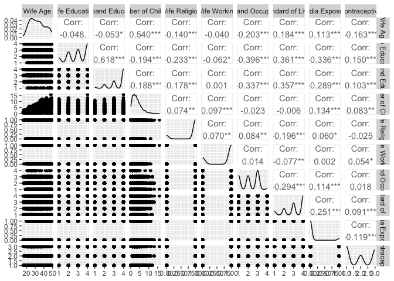<!-- -->

From the correlation matrix, number of children and wife’s age has high
positive correlation (0.54) as well as husband education and wife
education (0.62).

 

#### Variable Assessment

The distribution of wife’s age is not normal so I centralized it for
easier interpretation (wife_age.c).

Wife’s Age and Number of Children are discrete variables. The rest are
categorical or binary variables so I factored these variables. For
easier analysis, I changed the factoring of contraceptive method so that
short term (2) and long term (3) are in one category.

 

<table>
<thead>
<tr>
<th style="text-align:left;">
Var1
</th>
<th style="text-align:right;">
Freq
</th>
</tr>
</thead>
<tbody>
<tr>
<td style="text-align:left;">
0
</td>
<td style="text-align:right;">
0.4270197
</td>
</tr>
<tr>
<td style="text-align:left;">
1
</td>
<td style="text-align:right;">
0.5729803
</td>
</tr>
</tbody>
</table>

At a highlevel, in the sample 42% do not use contraceptive methods while
57% of woman do.

 

### Table 2: Individual Relationships, Standard Errors, 95% CI, p-values

#### 1. Wife Age vs Contraceptive

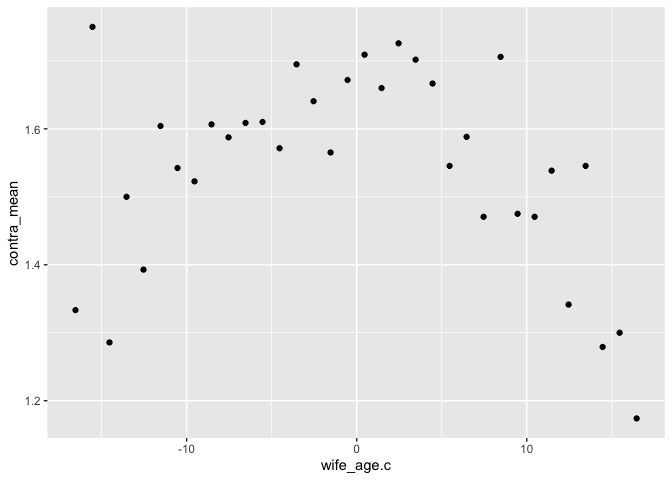<!-- -->

The graph shows a low then high then low pattern between wife’s age and
contraception use. Near the mean of wife’s age, which is 32, woman are
more likely to use contraception. The low and high end of the age ranges
are showing no contraception use. There is a violation of linearity
here.

Before modeling, I assessed the linearity of wife’s age using MFP.

MFP suggests I(wife_age.c2) + I(wife_age.c3)
transformation.

<table style="border-collapse:collapse; border:none;">
<tr>
<th style="border-top: double; text-align:center; font-style:normal; font-weight:bold; padding:0.2cm;  text-align:left; ">
 
</th>
<th colspan="4" style="border-top: double; text-align:center; font-style:normal; font-weight:bold; padding:0.2cm; ">
contra.f
</th>
<th colspan="4" style="border-top: double; text-align:center; font-style:normal; font-weight:bold; padding:0.2cm; ">
contra.f
</th>
</tr>
<tr>
<td style=" text-align:center; border-bottom:1px solid; font-style:italic; font-weight:normal;  text-align:left; ">
Predictors
</td>
<td style=" text-align:center; border-bottom:1px solid; font-style:italic; font-weight:normal;  ">
Odds Ratios
</td>
<td style=" text-align:center; border-bottom:1px solid; font-style:italic; font-weight:normal;  ">
std. Error
</td>
<td style=" text-align:center; border-bottom:1px solid; font-style:italic; font-weight:normal;  ">
CI
</td>
<td style=" text-align:center; border-bottom:1px solid; font-style:italic; font-weight:normal;  ">
p
</td>
<td style=" text-align:center; border-bottom:1px solid; font-style:italic; font-weight:normal;  ">
Odds Ratios
</td>
<td style=" text-align:center; border-bottom:1px solid; font-style:italic; font-weight:normal;  col7">
std. Error
</td>
<td style=" text-align:center; border-bottom:1px solid; font-style:italic; font-weight:normal;  col8">
CI
</td>
<td style=" text-align:center; border-bottom:1px solid; font-style:italic; font-weight:normal;  col9">
p
</td>
</tr>
<tr>
<td style=" padding:0.2cm; text-align:left; vertical-align:top; text-align:left; ">
(Intercept)
</td>
<td style=" padding:0.2cm; text-align:left; vertical-align:top; text-align:center;  ">
1.35
</td>
<td style=" padding:0.2cm; text-align:left; vertical-align:top; text-align:center;  ">
0.07
</td>
<td style=" padding:0.2cm; text-align:left; vertical-align:top; text-align:center;  ">
1.21 – 1.49
</td>
<td style=" padding:0.2cm; text-align:left; vertical-align:top; text-align:center;  ">
<strong>\<0.001</strong>
</td>
<td style=" padding:0.2cm; text-align:left; vertical-align:top; text-align:center;  ">
1.96
</td>
<td style=" padding:0.2cm; text-align:left; vertical-align:top; text-align:center;  col7">
0.15
</td>
<td style=" padding:0.2cm; text-align:left; vertical-align:top; text-align:center;  col8">
1.69 – 2.29
</td>
<td style=" padding:0.2cm; text-align:left; vertical-align:top; text-align:center;  col9">
<strong>\<0.001</strong>
</td>
</tr>
<tr>
<td style=" padding:0.2cm; text-align:left; vertical-align:top; text-align:left; ">
wife age c
</td>
<td style=" padding:0.2cm; text-align:left; vertical-align:top; text-align:center;  ">
0.98
</td>
<td style=" padding:0.2cm; text-align:left; vertical-align:top; text-align:center;  ">
0.01
</td>
<td style=" padding:0.2cm; text-align:left; vertical-align:top; text-align:center;  ">
0.97 – 0.99
</td>
<td style=" padding:0.2cm; text-align:left; vertical-align:top; text-align:center;  ">
<strong>\<0.001</strong>
</td>
<td style=" padding:0.2cm; text-align:left; vertical-align:top; text-align:center;  ">
1.01
</td>
<td style=" padding:0.2cm; text-align:left; vertical-align:top; text-align:center;  col7">
0.01
</td>
<td style=" padding:0.2cm; text-align:left; vertical-align:top; text-align:center;  col8">
0.98 – 1.04
</td>
<td style=" padding:0.2cm; text-align:left; vertical-align:top; text-align:center;  col9">
0.417
</td>
</tr>
<tr>
<td style=" padding:0.2cm; text-align:left; vertical-align:top; text-align:left; ">
wife age c^2
</td>
<td style=" padding:0.2cm; text-align:left; vertical-align:top; text-align:center;  ">
</td>
<td style=" padding:0.2cm; text-align:left; vertical-align:top; text-align:center;  ">
</td>
<td style=" padding:0.2cm; text-align:left; vertical-align:top; text-align:center;  ">
</td>
<td style=" padding:0.2cm; text-align:left; vertical-align:top; text-align:center;  ">
</td>
<td style=" padding:0.2cm; text-align:left; vertical-align:top; text-align:center;  ">
0.99
</td>
<td style=" padding:0.2cm; text-align:left; vertical-align:top; text-align:center;  col7">
0.00
</td>
<td style=" padding:0.2cm; text-align:left; vertical-align:top; text-align:center;  col8">
0.99 – 1.00
</td>
<td style=" padding:0.2cm; text-align:left; vertical-align:top; text-align:center;  col9">
<strong>\<0.001</strong>
</td>
</tr>
<tr>
<td style=" padding:0.2cm; text-align:left; vertical-align:top; text-align:left; ">
wife age c^3
</td>
<td style=" padding:0.2cm; text-align:left; vertical-align:top; text-align:center;  ">
</td>
<td style=" padding:0.2cm; text-align:left; vertical-align:top; text-align:center;  ">
</td>
<td style=" padding:0.2cm; text-align:left; vertical-align:top; text-align:center;  ">
</td>
<td style=" padding:0.2cm; text-align:left; vertical-align:top; text-align:center;  ">
</td>
<td style=" padding:0.2cm; text-align:left; vertical-align:top; text-align:center;  ">
1.00
</td>
<td style=" padding:0.2cm; text-align:left; vertical-align:top; text-align:center;  col7">
0.00
</td>
<td style=" padding:0.2cm; text-align:left; vertical-align:top; text-align:center;  col8">
1.00 – 1.00
</td>
<td style=" padding:0.2cm; text-align:left; vertical-align:top; text-align:center;  col9">
0.074
</td>
</tr>
<tr>
<td style=" padding:0.2cm; text-align:left; vertical-align:top; text-align:left; padding-top:0.1cm; padding-bottom:0.1cm; border-top:1px solid;">
Observations
</td>
<td style=" padding:0.2cm; text-align:left; vertical-align:top; padding-top:0.1cm; padding-bottom:0.1cm; text-align:left; border-top:1px solid;" colspan="4">
1473
</td>
<td style=" padding:0.2cm; text-align:left; vertical-align:top; padding-top:0.1cm; padding-bottom:0.1cm; text-align:left; border-top:1px solid;" colspan="4">
1473
</td>
</tr>
<tr>
<td style=" padding:0.2cm; text-align:left; vertical-align:top; text-align:left; padding-top:0.1cm; padding-bottom:0.1cm;">
R2 Tjur
</td>
<td style=" padding:0.2cm; text-align:left; vertical-align:top; padding-top:0.1cm; padding-bottom:0.1cm; text-align:left;" colspan="4">
0.009
</td>
<td style=" padding:0.2cm; text-align:left; vertical-align:top; padding-top:0.1cm; padding-bottom:0.1cm; text-align:left;" colspan="4">
0.045
</td>
</tr>
<tr>
<td style=" padding:0.2cm; text-align:left; vertical-align:top; text-align:left; padding-top:0.1cm; padding-bottom:0.1cm;">
AIC
</td>
<td style=" padding:0.2cm; text-align:left; vertical-align:top; padding-top:0.1cm; padding-bottom:0.1cm; text-align:left;" colspan="4">
2001.765
</td>
<td style=" padding:0.2cm; text-align:left; vertical-align:top; padding-top:0.1cm; padding-bottom:0.1cm; text-align:left;" colspan="4">
1952.239
</td>
</tr>
</table>

After transformation, wife_age.c and wife_age.c3 are no
longer significant. Based off the earlier plot, I think a squared
transformation of wife_age.c would suffice.

 

#### 2. Wife Education vs Contraceptive

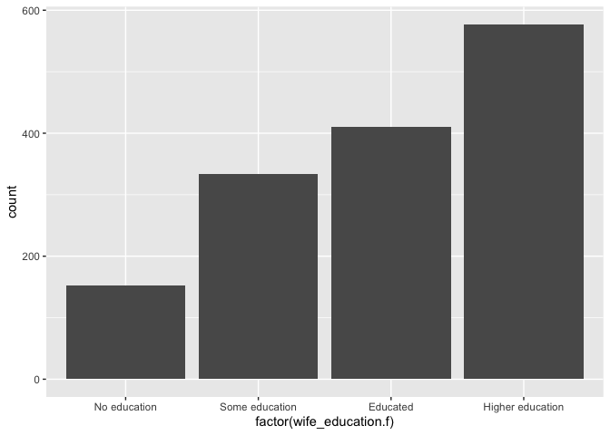<!-- -->
<table>
<thead>
<tr>
<th style="text-align:left;">
</th>
<th style="text-align:right;">
0
</th>
<th style="text-align:right;">
1
</th>
</tr>
</thead>
<tbody>
<tr>
<td style="text-align:left;">
No education
</td>
<td style="text-align:right;">
103
</td>
<td style="text-align:right;">
49
</td>
</tr>
<tr>
<td style="text-align:left;">
Some education
</td>
<td style="text-align:right;">
176
</td>
<td style="text-align:right;">
158
</td>
</tr>
<tr>
<td style="text-align:left;">
Educated
</td>
<td style="text-align:right;">
175
</td>
<td style="text-align:right;">
235
</td>
</tr>
<tr>
<td style="text-align:left;">
Higher education
</td>
<td style="text-align:right;">
175
</td>
<td style="text-align:right;">
402
</td>
</tr>
</tbody>
</table>

From the bar chart, there are more woman that have education that those
that have little to none. The table shows woman with minimal education
mostly do not use contraceptive methods while woman with higher
education mostly do use.

 

<table style="border-collapse:collapse; border:none;">
<tr>
<th style="border-top: double; text-align:center; font-style:normal; font-weight:bold; padding:0.2cm;  text-align:left; ">
 
</th>
<th colspan="4" style="border-top: double; text-align:center; font-style:normal; font-weight:bold; padding:0.2cm; ">
contra.f
</th>
</tr>
<tr>
<td style=" text-align:center; border-bottom:1px solid; font-style:italic; font-weight:normal;  text-align:left; ">
Predictors
</td>
<td style=" text-align:center; border-bottom:1px solid; font-style:italic; font-weight:normal;  ">
Odds Ratios
</td>
<td style=" text-align:center; border-bottom:1px solid; font-style:italic; font-weight:normal;  ">
std. Error
</td>
<td style=" text-align:center; border-bottom:1px solid; font-style:italic; font-weight:normal;  ">
CI
</td>
<td style=" text-align:center; border-bottom:1px solid; font-style:italic; font-weight:normal;  ">
p
</td>
</tr>
<tr>
<td style=" padding:0.2cm; text-align:left; vertical-align:top; text-align:left; ">
(Intercept)
</td>
<td style=" padding:0.2cm; text-align:left; vertical-align:top; text-align:center;  ">
0.48
</td>
<td style=" padding:0.2cm; text-align:left; vertical-align:top; text-align:center;  ">
0.08
</td>
<td style=" padding:0.2cm; text-align:left; vertical-align:top; text-align:center;  ">
0.34 – 0.66
</td>
<td style=" padding:0.2cm; text-align:left; vertical-align:top; text-align:center;  ">
<strong>\<0.001</strong>
</td>
</tr>
<tr>
<td style=" padding:0.2cm; text-align:left; vertical-align:top; text-align:left; ">
wife education f \[Some education\]
</td>
<td style=" padding:0.2cm; text-align:left; vertical-align:top; text-align:center;  ">
1.89
</td>
<td style=" padding:0.2cm; text-align:left; vertical-align:top; text-align:center;  ">
0.39
</td>
<td style=" padding:0.2cm; text-align:left; vertical-align:top; text-align:center;  ">
1.27 – 2.84
</td>
<td style=" padding:0.2cm; text-align:left; vertical-align:top; text-align:center;  ">
<strong>0.002</strong>
</td>
</tr>
<tr>
<td style=" padding:0.2cm; text-align:left; vertical-align:top; text-align:left; ">
wife education f \[Educated\]
</td>
<td style=" padding:0.2cm; text-align:left; vertical-align:top; text-align:center;  ">
2.82
</td>
<td style=" padding:0.2cm; text-align:left; vertical-align:top; text-align:center;  ">
0.57
</td>
<td style=" padding:0.2cm; text-align:left; vertical-align:top; text-align:center;  ">
1.92 – 4.20
</td>
<td style=" padding:0.2cm; text-align:left; vertical-align:top; text-align:center;  ">
<strong>\<0.001</strong>
</td>
</tr>
<tr>
<td style=" padding:0.2cm; text-align:left; vertical-align:top; text-align:left; ">
wife education f \[Higher education\]
</td>
<td style=" padding:0.2cm; text-align:left; vertical-align:top; text-align:center;  ">
4.83
</td>
<td style=" padding:0.2cm; text-align:left; vertical-align:top; text-align:center;  ">
0.95
</td>
<td style=" padding:0.2cm; text-align:left; vertical-align:top; text-align:center;  ">
3.31 – 7.13
</td>
<td style=" padding:0.2cm; text-align:left; vertical-align:top; text-align:center;  ">
<strong>\<0.001</strong>
</td>
</tr>
<tr>
<td style=" padding:0.2cm; text-align:left; vertical-align:top; text-align:left; padding-top:0.1cm; padding-bottom:0.1cm; border-top:1px solid;">
Observations
</td>
<td style=" padding:0.2cm; text-align:left; vertical-align:top; padding-top:0.1cm; padding-bottom:0.1cm; text-align:left; border-top:1px solid;" colspan="4">
1473
</td>
</tr>
<tr>
<td style=" padding:0.2cm; text-align:left; vertical-align:top; text-align:left; padding-top:0.1cm; padding-bottom:0.1cm;">
R2 Tjur
</td>
<td style=" padding:0.2cm; text-align:left; vertical-align:top; padding-top:0.1cm; padding-bottom:0.1cm; text-align:left;" colspan="4">
0.060
</td>
</tr>
<tr>
<td style=" padding:0.2cm; text-align:left; vertical-align:top; text-align:left; padding-top:0.1cm; padding-bottom:0.1cm;">
AIC
</td>
<td style=" padding:0.2cm; text-align:left; vertical-align:top; padding-top:0.1cm; padding-bottom:0.1cm; text-align:left;" colspan="4">
1928.855
</td>
</tr>
</table>

Wife’s education is statistically related to contraceptive use.

 

#### 3. Husband Education vs Contraceptive

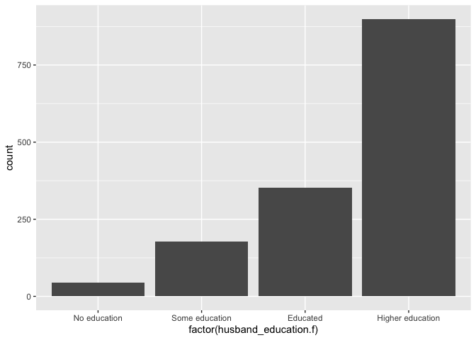<!-- -->

<table>
<thead>
<tr>
<th style="text-align:left;">
</th>
<th style="text-align:right;">
0
</th>
<th style="text-align:right;">
1
</th>
</tr>
</thead>
<tbody>
<tr>
<td style="text-align:left;">
No education
</td>
<td style="text-align:right;">
31
</td>
<td style="text-align:right;">
13
</td>
</tr>
<tr>
<td style="text-align:left;">
Some education
</td>
<td style="text-align:right;">
99
</td>
<td style="text-align:right;">
79
</td>
</tr>
<tr>
<td style="text-align:left;">
Educated
</td>
<td style="text-align:right;">
161
</td>
<td style="text-align:right;">
191
</td>
</tr>
<tr>
<td style="text-align:left;">
Higher education
</td>
<td style="text-align:right;">
338
</td>
<td style="text-align:right;">
561
</td>
</tr>
</tbody>
</table>

The barchart show significantly more men with higher education in the
sample. Men with higher education have wives that are more likely to use
contraception.

 

<table style="border-collapse:collapse; border:none;">
<tr>
<th style="border-top: double; text-align:center; font-style:normal; font-weight:bold; padding:0.2cm;  text-align:left; ">
 
</th>
<th colspan="4" style="border-top: double; text-align:center; font-style:normal; font-weight:bold; padding:0.2cm; ">
contra.f
</th>
</tr>
<tr>
<td style=" text-align:center; border-bottom:1px solid; font-style:italic; font-weight:normal;  text-align:left; ">
Predictors
</td>
<td style=" text-align:center; border-bottom:1px solid; font-style:italic; font-weight:normal;  ">
Odds Ratios
</td>
<td style=" text-align:center; border-bottom:1px solid; font-style:italic; font-weight:normal;  ">
std. Error
</td>
<td style=" text-align:center; border-bottom:1px solid; font-style:italic; font-weight:normal;  ">
CI
</td>
<td style=" text-align:center; border-bottom:1px solid; font-style:italic; font-weight:normal;  ">
p
</td>
</tr>
<tr>
<td style=" padding:0.2cm; text-align:left; vertical-align:top; text-align:left; ">
(Intercept)
</td>
<td style=" padding:0.2cm; text-align:left; vertical-align:top; text-align:center;  ">
0.42
</td>
<td style=" padding:0.2cm; text-align:left; vertical-align:top; text-align:center;  ">
0.14
</td>
<td style=" padding:0.2cm; text-align:left; vertical-align:top; text-align:center;  ">
0.21 – 0.78
</td>
<td style=" padding:0.2cm; text-align:left; vertical-align:top; text-align:center;  ">
<strong>0.009</strong>
</td>
</tr>
<tr>
<td style=" padding:0.2cm; text-align:left; vertical-align:top; text-align:left; ">
husband education f \[Some education\]
</td>
<td style=" padding:0.2cm; text-align:left; vertical-align:top; text-align:center;  ">
1.90
</td>
<td style=" padding:0.2cm; text-align:left; vertical-align:top; text-align:center;  ">
0.69
</td>
<td style=" padding:0.2cm; text-align:left; vertical-align:top; text-align:center;  ">
0.95 – 3.99
</td>
<td style=" padding:0.2cm; text-align:left; vertical-align:top; text-align:center;  ">
0.077
</td>
</tr>
<tr>
<td style=" padding:0.2cm; text-align:left; vertical-align:top; text-align:left; ">
husband education f \[Educated\]
</td>
<td style=" padding:0.2cm; text-align:left; vertical-align:top; text-align:center;  ">
2.83
</td>
<td style=" padding:0.2cm; text-align:left; vertical-align:top; text-align:center;  ">
0.98
</td>
<td style=" padding:0.2cm; text-align:left; vertical-align:top; text-align:center;  ">
1.46 – 5.77
</td>
<td style=" padding:0.2cm; text-align:left; vertical-align:top; text-align:center;  ">
<strong>0.003</strong>
</td>
</tr>
<tr>
<td style=" padding:0.2cm; text-align:left; vertical-align:top; text-align:left; ">
husband education f \[Higher education\]
</td>
<td style=" padding:0.2cm; text-align:left; vertical-align:top; text-align:center;  ">
3.96
</td>
<td style=" padding:0.2cm; text-align:left; vertical-align:top; text-align:center;  ">
1.34
</td>
<td style=" padding:0.2cm; text-align:left; vertical-align:top; text-align:center;  ">
2.09 – 7.93
</td>
<td style=" padding:0.2cm; text-align:left; vertical-align:top; text-align:center;  ">
<strong>\<0.001</strong>
</td>
</tr>
<tr>
<td style=" padding:0.2cm; text-align:left; vertical-align:top; text-align:left; padding-top:0.1cm; padding-bottom:0.1cm; border-top:1px solid;">
Observations
</td>
<td style=" padding:0.2cm; text-align:left; vertical-align:top; padding-top:0.1cm; padding-bottom:0.1cm; text-align:left; border-top:1px solid;" colspan="4">
1473
</td>
</tr>
<tr>
<td style=" padding:0.2cm; text-align:left; vertical-align:top; text-align:left; padding-top:0.1cm; padding-bottom:0.1cm;">
R2 Tjur
</td>
<td style=" padding:0.2cm; text-align:left; vertical-align:top; padding-top:0.1cm; padding-bottom:0.1cm; text-align:left;" colspan="4">
0.025
</td>
</tr>
<tr>
<td style=" padding:0.2cm; text-align:left; vertical-align:top; text-align:left; padding-top:0.1cm; padding-bottom:0.1cm;">
AIC
</td>
<td style=" padding:0.2cm; text-align:left; vertical-align:top; padding-top:0.1cm; padding-bottom:0.1cm; text-align:left;" colspan="4">
1981.718
</td>
</tr>
</table>

Husband’s education is statistically related to contraceptive use.

 

#### 4. Number of Children vs Contraceptive

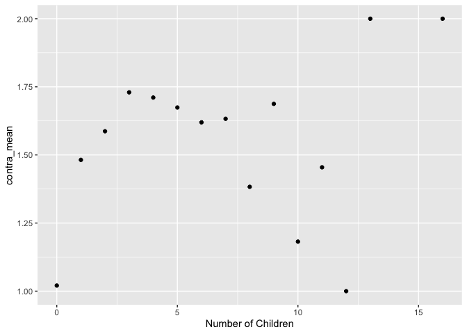<!-- -->

Starting at 0 children, there is no contraception use. As the number of
children increase, women are more likely to use contraception then it
starts dropping after 5 children. Between 5-13 children, there is a
decrease in contraception use. After 13, there is a spike in women using
contraception.

Before modeling, I assessed the linearity of number of children using
MFP.

The MFP results showed linear form of number of children is fine.

<table style="border-collapse:collapse; border:none;">
<tr>
<th style="border-top: double; text-align:center; font-style:normal; font-weight:bold; padding:0.2cm;  text-align:left; ">
 
</th>
<th colspan="4" style="border-top: double; text-align:center; font-style:normal; font-weight:bold; padding:0.2cm; ">
contra.f
</th>
</tr>
<tr>
<td style=" text-align:center; border-bottom:1px solid; font-style:italic; font-weight:normal;  text-align:left; ">
Predictors
</td>
<td style=" text-align:center; border-bottom:1px solid; font-style:italic; font-weight:normal;  ">
Odds Ratios
</td>
<td style=" text-align:center; border-bottom:1px solid; font-style:italic; font-weight:normal;  ">
std. Error
</td>
<td style=" text-align:center; border-bottom:1px solid; font-style:italic; font-weight:normal;  ">
CI
</td>
<td style=" text-align:center; border-bottom:1px solid; font-style:italic; font-weight:normal;  ">
p
</td>
</tr>
<tr>
<td style=" padding:0.2cm; text-align:left; vertical-align:top; text-align:left; ">
(Intercept)
</td>
<td style=" padding:0.2cm; text-align:left; vertical-align:top; text-align:center;  ">
0.95
</td>
<td style=" padding:0.2cm; text-align:left; vertical-align:top; text-align:center;  ">
0.09
</td>
<td style=" padding:0.2cm; text-align:left; vertical-align:top; text-align:center;  ">
0.80 – 1.14
</td>
<td style=" padding:0.2cm; text-align:left; vertical-align:top; text-align:center;  ">
0.594
</td>
</tr>
<tr>
<td style=" padding:0.2cm; text-align:left; vertical-align:top; text-align:left; ">
Number of Children
</td>
<td style=" padding:0.2cm; text-align:left; vertical-align:top; text-align:center;  ">
1.11
</td>
<td style=" padding:0.2cm; text-align:left; vertical-align:top; text-align:center;  ">
0.03
</td>
<td style=" padding:0.2cm; text-align:left; vertical-align:top; text-align:center;  ">
1.06 – 1.17
</td>
<td style=" padding:0.2cm; text-align:left; vertical-align:top; text-align:center;  ">
<strong>\<0.001</strong>
</td>
</tr>
<tr>
<td style=" padding:0.2cm; text-align:left; vertical-align:top; text-align:left; padding-top:0.1cm; padding-bottom:0.1cm; border-top:1px solid;">
Observations
</td>
<td style=" padding:0.2cm; text-align:left; vertical-align:top; padding-top:0.1cm; padding-bottom:0.1cm; text-align:left; border-top:1px solid;" colspan="4">
1473
</td>
</tr>
<tr>
<td style=" padding:0.2cm; text-align:left; vertical-align:top; text-align:left; padding-top:0.1cm; padding-bottom:0.1cm;">
R2 Tjur
</td>
<td style=" padding:0.2cm; text-align:left; vertical-align:top; padding-top:0.1cm; padding-bottom:0.1cm; text-align:left;" colspan="4">
0.015
</td>
</tr>
<tr>
<td style=" padding:0.2cm; text-align:left; vertical-align:top; text-align:left; padding-top:0.1cm; padding-bottom:0.1cm;">
AIC
</td>
<td style=" padding:0.2cm; text-align:left; vertical-align:top; padding-top:0.1cm; padding-bottom:0.1cm; text-align:left;" colspan="4">
1992.951
</td>
</tr>
</table>

 

#### 5. Wife Religion vs Contraceptive

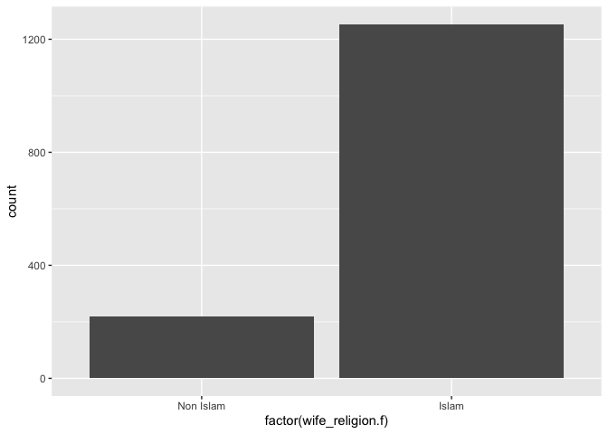<!-- -->

<table>
<thead>
<tr>
<th style="text-align:left;">
</th>
<th style="text-align:right;">
0
</th>
<th style="text-align:right;">
1
</th>
</tr>
</thead>
<tbody>
<tr>
<td style="text-align:left;">
Non Islam
</td>
<td style="text-align:right;">
75
</td>
<td style="text-align:right;">
145
</td>
</tr>
<tr>
<td style="text-align:left;">
Islam
</td>
<td style="text-align:right;">
554
</td>
<td style="text-align:right;">
699
</td>
</tr>
</tbody>
</table>

The barchart shows that most of the woman in the sample are Muslim.
Solely based of the table, more woman use contraception regardless of
religion.

<table style="border-collapse:collapse; border:none;">
<tr>
<th style="border-top: double; text-align:center; font-style:normal; font-weight:bold; padding:0.2cm;  text-align:left; ">
 
</th>
<th colspan="4" style="border-top: double; text-align:center; font-style:normal; font-weight:bold; padding:0.2cm; ">
contra.f
</th>
</tr>
<tr>
<td style=" text-align:center; border-bottom:1px solid; font-style:italic; font-weight:normal;  text-align:left; ">
Predictors
</td>
<td style=" text-align:center; border-bottom:1px solid; font-style:italic; font-weight:normal;  ">
Odds Ratios
</td>
<td style=" text-align:center; border-bottom:1px solid; font-style:italic; font-weight:normal;  ">
std. Error
</td>
<td style=" text-align:center; border-bottom:1px solid; font-style:italic; font-weight:normal;  ">
CI
</td>
<td style=" text-align:center; border-bottom:1px solid; font-style:italic; font-weight:normal;  ">
p
</td>
</tr>
<tr>
<td style=" padding:0.2cm; text-align:left; vertical-align:top; text-align:left; ">
(Intercept)
</td>
<td style=" padding:0.2cm; text-align:left; vertical-align:top; text-align:center;  ">
1.93
</td>
<td style=" padding:0.2cm; text-align:left; vertical-align:top; text-align:center;  ">
0.27
</td>
<td style=" padding:0.2cm; text-align:left; vertical-align:top; text-align:center;  ">
1.47 – 2.57
</td>
<td style=" padding:0.2cm; text-align:left; vertical-align:top; text-align:center;  ">
<strong>\<0.001</strong>
</td>
</tr>
<tr>
<td style=" padding:0.2cm; text-align:left; vertical-align:top; text-align:left; ">
wife religion f \[Islam\]
</td>
<td style=" padding:0.2cm; text-align:left; vertical-align:top; text-align:center;  ">
0.65
</td>
<td style=" padding:0.2cm; text-align:left; vertical-align:top; text-align:center;  ">
0.10
</td>
<td style=" padding:0.2cm; text-align:left; vertical-align:top; text-align:center;  ">
0.48 – 0.88
</td>
<td style=" padding:0.2cm; text-align:left; vertical-align:top; text-align:center;  ">
<strong>0.005</strong>
</td>
</tr>
<tr>
<td style=" padding:0.2cm; text-align:left; vertical-align:top; text-align:left; padding-top:0.1cm; padding-bottom:0.1cm; border-top:1px solid;">
Observations
</td>
<td style=" padding:0.2cm; text-align:left; vertical-align:top; padding-top:0.1cm; padding-bottom:0.1cm; text-align:left; border-top:1px solid;" colspan="4">
1473
</td>
</tr>
<tr>
<td style=" padding:0.2cm; text-align:left; vertical-align:top; text-align:left; padding-top:0.1cm; padding-bottom:0.1cm;">
R2 Tjur
</td>
<td style=" padding:0.2cm; text-align:left; vertical-align:top; padding-top:0.1cm; padding-bottom:0.1cm; text-align:left;" colspan="4">
0.005
</td>
</tr>
<tr>
<td style=" padding:0.2cm; text-align:left; vertical-align:top; text-align:left; padding-top:0.1cm; padding-bottom:0.1cm;">
AIC
</td>
<td style=" padding:0.2cm; text-align:left; vertical-align:top; padding-top:0.1cm; padding-bottom:0.1cm; text-align:left;" colspan="4">
2006.530
</td>
</tr>
</table>

Wife’s religion is statistically related to contraceptive use.

 

#### 6. Wife Working vs Contraceptive

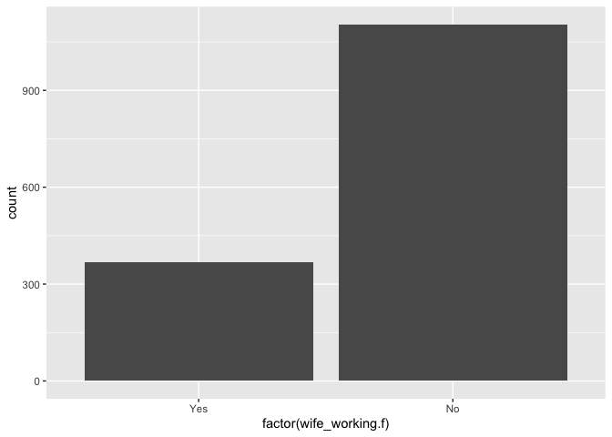<!-- -->
<table>
<thead>
<tr>
<th style="text-align:left;">
</th>
<th style="text-align:right;">
0
</th>
<th style="text-align:right;">
1
</th>
</tr>
</thead>
<tbody>
<tr>
<td style="text-align:left;">
Yes
</td>
<td style="text-align:right;">
170
</td>
<td style="text-align:right;">
199
</td>
</tr>
<tr>
<td style="text-align:left;">
No
</td>
<td style="text-align:right;">
459
</td>
<td style="text-align:right;">
645
</td>
</tr>
</tbody>
</table>

From the barchart, there are more woman in the sample that do not work.
There is not a huge difference in contraception use among woman who work
(20) versus woman that do not work (186).

<table style="border-collapse:collapse; border:none;">
<tr>
<th style="border-top: double; text-align:center; font-style:normal; font-weight:bold; padding:0.2cm;  text-align:left; ">
 
</th>
<th colspan="4" style="border-top: double; text-align:center; font-style:normal; font-weight:bold; padding:0.2cm; ">
contra.f
</th>
</tr>
<tr>
<td style=" text-align:center; border-bottom:1px solid; font-style:italic; font-weight:normal;  text-align:left; ">
Predictors
</td>
<td style=" text-align:center; border-bottom:1px solid; font-style:italic; font-weight:normal;  ">
Odds Ratios
</td>
<td style=" text-align:center; border-bottom:1px solid; font-style:italic; font-weight:normal;  ">
std. Error
</td>
<td style=" text-align:center; border-bottom:1px solid; font-style:italic; font-weight:normal;  ">
CI
</td>
<td style=" text-align:center; border-bottom:1px solid; font-style:italic; font-weight:normal;  ">
p
</td>
</tr>
<tr>
<td style=" padding:0.2cm; text-align:left; vertical-align:top; text-align:left; ">
(Intercept)
</td>
<td style=" padding:0.2cm; text-align:left; vertical-align:top; text-align:center;  ">
1.17
</td>
<td style=" padding:0.2cm; text-align:left; vertical-align:top; text-align:center;  ">
0.12
</td>
<td style=" padding:0.2cm; text-align:left; vertical-align:top; text-align:center;  ">
0.95 – 1.44
</td>
<td style=" padding:0.2cm; text-align:left; vertical-align:top; text-align:center;  ">
0.132
</td>
</tr>
<tr>
<td style=" padding:0.2cm; text-align:left; vertical-align:top; text-align:left; ">
wife working f \[No\]
</td>
<td style=" padding:0.2cm; text-align:left; vertical-align:top; text-align:center;  ">
1.20
</td>
<td style=" padding:0.2cm; text-align:left; vertical-align:top; text-align:center;  ">
0.15
</td>
<td style=" padding:0.2cm; text-align:left; vertical-align:top; text-align:center;  ">
0.95 – 1.52
</td>
<td style=" padding:0.2cm; text-align:left; vertical-align:top; text-align:center;  ">
0.131
</td>
</tr>
<tr>
<td style=" padding:0.2cm; text-align:left; vertical-align:top; text-align:left; padding-top:0.1cm; padding-bottom:0.1cm; border-top:1px solid;">
Observations
</td>
<td style=" padding:0.2cm; text-align:left; vertical-align:top; padding-top:0.1cm; padding-bottom:0.1cm; text-align:left; border-top:1px solid;" colspan="4">
1473
</td>
</tr>
<tr>
<td style=" padding:0.2cm; text-align:left; vertical-align:top; text-align:left; padding-top:0.1cm; padding-bottom:0.1cm;">
R2 Tjur
</td>
<td style=" padding:0.2cm; text-align:left; vertical-align:top; padding-top:0.1cm; padding-bottom:0.1cm; text-align:left;" colspan="4">
0.002
</td>
</tr>
<tr>
<td style=" padding:0.2cm; text-align:left; vertical-align:top; text-align:left; padding-top:0.1cm; padding-bottom:0.1cm;">
AIC
</td>
<td style=" padding:0.2cm; text-align:left; vertical-align:top; padding-top:0.1cm; padding-bottom:0.1cm; text-align:left;" colspan="4">
2012.243
</td>
</tr>
</table>

Wife working is not statistically significant to contraceptive use. This
will be excluded from final model.

 

#### 7. Husband Occupation vs Contraceptive

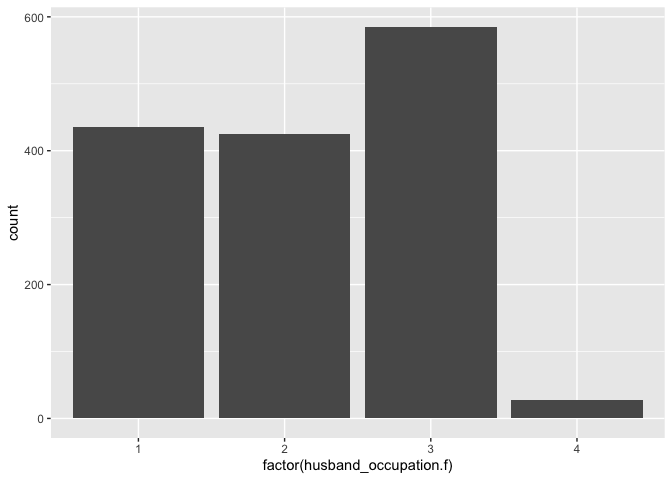<!-- -->
<table>
<thead>
<tr>
<th style="text-align:right;">
0
</th>
<th style="text-align:right;">
1
</th>
</tr>
</thead>
<tbody>
<tr>
<td style="text-align:right;">
158
</td>
<td style="text-align:right;">
278
</td>
</tr>
<tr>
<td style="text-align:right;">
200
</td>
<td style="text-align:right;">
225
</td>
</tr>
<tr>
<td style="text-align:right;">
258
</td>
<td style="text-align:right;">
327
</td>
</tr>
<tr>
<td style="text-align:right;">
13
</td>
<td style="text-align:right;">
14
</td>
</tr>
</tbody>
</table>
<table style="border-collapse:collapse; border:none;">
<tr>
<th style="border-top: double; text-align:center; font-style:normal; font-weight:bold; padding:0.2cm;  text-align:left; ">
 
</th>
<th colspan="4" style="border-top: double; text-align:center; font-style:normal; font-weight:bold; padding:0.2cm; ">
contra.f
</th>
</tr>
<tr>
<td style=" text-align:center; border-bottom:1px solid; font-style:italic; font-weight:normal;  text-align:left; ">
Predictors
</td>
<td style=" text-align:center; border-bottom:1px solid; font-style:italic; font-weight:normal;  ">
Odds Ratios
</td>
<td style=" text-align:center; border-bottom:1px solid; font-style:italic; font-weight:normal;  ">
std. Error
</td>
<td style=" text-align:center; border-bottom:1px solid; font-style:italic; font-weight:normal;  ">
CI
</td>
<td style=" text-align:center; border-bottom:1px solid; font-style:italic; font-weight:normal;  ">
p
</td>
</tr>
<tr>
<td style=" padding:0.2cm; text-align:left; vertical-align:top; text-align:left; ">
(Intercept)
</td>
<td style=" padding:0.2cm; text-align:left; vertical-align:top; text-align:center;  ">
1.76
</td>
<td style=" padding:0.2cm; text-align:left; vertical-align:top; text-align:center;  ">
0.18
</td>
<td style=" padding:0.2cm; text-align:left; vertical-align:top; text-align:center;  ">
1.45 – 2.14
</td>
<td style=" padding:0.2cm; text-align:left; vertical-align:top; text-align:center;  ">
<strong>\<0.001</strong>
</td>
</tr>
<tr>
<td style=" padding:0.2cm; text-align:left; vertical-align:top; text-align:left; ">
husband occupation f \[2\]
</td>
<td style=" padding:0.2cm; text-align:left; vertical-align:top; text-align:center;  ">
0.64
</td>
<td style=" padding:0.2cm; text-align:left; vertical-align:top; text-align:center;  ">
0.09
</td>
<td style=" padding:0.2cm; text-align:left; vertical-align:top; text-align:center;  ">
0.49 – 0.84
</td>
<td style=" padding:0.2cm; text-align:left; vertical-align:top; text-align:center;  ">
<strong>0.001</strong>
</td>
</tr>
<tr>
<td style=" padding:0.2cm; text-align:left; vertical-align:top; text-align:left; ">
husband occupation f \[3\]
</td>
<td style=" padding:0.2cm; text-align:left; vertical-align:top; text-align:center;  ">
0.72
</td>
<td style=" padding:0.2cm; text-align:left; vertical-align:top; text-align:center;  ">
0.09
</td>
<td style=" padding:0.2cm; text-align:left; vertical-align:top; text-align:center;  ">
0.56 – 0.93
</td>
<td style=" padding:0.2cm; text-align:left; vertical-align:top; text-align:center;  ">
<strong>0.012</strong>
</td>
</tr>
<tr>
<td style=" padding:0.2cm; text-align:left; vertical-align:top; text-align:left; ">
husband occupation f \[4\]
</td>
<td style=" padding:0.2cm; text-align:left; vertical-align:top; text-align:center;  ">
0.61
</td>
<td style=" padding:0.2cm; text-align:left; vertical-align:top; text-align:center;  ">
0.24
</td>
<td style=" padding:0.2cm; text-align:left; vertical-align:top; text-align:center;  ">
0.28 – 1.35
</td>
<td style=" padding:0.2cm; text-align:left; vertical-align:top; text-align:center;  ">
0.217
</td>
</tr>
<tr>
<td style=" padding:0.2cm; text-align:left; vertical-align:top; text-align:left; padding-top:0.1cm; padding-bottom:0.1cm; border-top:1px solid;">
Observations
</td>
<td style=" padding:0.2cm; text-align:left; vertical-align:top; padding-top:0.1cm; padding-bottom:0.1cm; text-align:left; border-top:1px solid;" colspan="4">
1473
</td>
</tr>
<tr>
<td style=" padding:0.2cm; text-align:left; vertical-align:top; text-align:left; padding-top:0.1cm; padding-bottom:0.1cm;">
R2 Tjur
</td>
<td style=" padding:0.2cm; text-align:left; vertical-align:top; padding-top:0.1cm; padding-bottom:0.1cm; text-align:left;" colspan="4">
0.008
</td>
</tr>
<tr>
<td style=" padding:0.2cm; text-align:left; vertical-align:top; text-align:left; padding-top:0.1cm; padding-bottom:0.1cm;">
AIC
</td>
<td style=" padding:0.2cm; text-align:left; vertical-align:top; padding-top:0.1cm; padding-bottom:0.1cm; text-align:left;" colspan="4">
2006.888
</td>
</tr>
</table>

Husband occupation is not statistically significant to contraceptive
use. This will be excluded from final model.

 

#### 8. Standard of Living vs Contraceptive

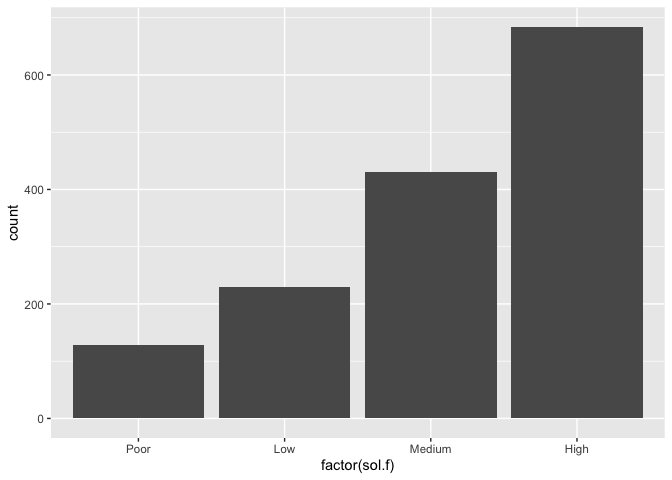<!-- -->
<table>
<thead>
<tr>
<th style="text-align:left;">
</th>
<th style="text-align:right;">
0
</th>
<th style="text-align:right;">
1
</th>
</tr>
</thead>
<tbody>
<tr>
<td style="text-align:left;">
Poor
</td>
<td style="text-align:right;">
80
</td>
<td style="text-align:right;">
49
</td>
</tr>
<tr>
<td style="text-align:left;">
Low
</td>
<td style="text-align:right;">
117
</td>
<td style="text-align:right;">
112
</td>
</tr>
<tr>
<td style="text-align:left;">
Medium
</td>
<td style="text-align:right;">
184
</td>
<td style="text-align:right;">
247
</td>
</tr>
<tr>
<td style="text-align:left;">
High
</td>
<td style="text-align:right;">
248
</td>
<td style="text-align:right;">
436
</td>
</tr>
</tbody>
</table>

More women in the sample have a high standard of living. Those with low
or poor are do not use contraception more than those with medium or high
standard of living.

<table style="border-collapse:collapse; border:none;">
<tr>
<th style="border-top: double; text-align:center; font-style:normal; font-weight:bold; padding:0.2cm;  text-align:left; ">
 
</th>
<th colspan="4" style="border-top: double; text-align:center; font-style:normal; font-weight:bold; padding:0.2cm; ">
contra.f
</th>
</tr>
<tr>
<td style=" text-align:center; border-bottom:1px solid; font-style:italic; font-weight:normal;  text-align:left; ">
Predictors
</td>
<td style=" text-align:center; border-bottom:1px solid; font-style:italic; font-weight:normal;  ">
Odds Ratios
</td>
<td style=" text-align:center; border-bottom:1px solid; font-style:italic; font-weight:normal;  ">
std. Error
</td>
<td style=" text-align:center; border-bottom:1px solid; font-style:italic; font-weight:normal;  ">
CI
</td>
<td style=" text-align:center; border-bottom:1px solid; font-style:italic; font-weight:normal;  ">
p
</td>
</tr>
<tr>
<td style=" padding:0.2cm; text-align:left; vertical-align:top; text-align:left; ">
(Intercept)
</td>
<td style=" padding:0.2cm; text-align:left; vertical-align:top; text-align:center;  ">
0.61
</td>
<td style=" padding:0.2cm; text-align:left; vertical-align:top; text-align:center;  ">
0.11
</td>
<td style=" padding:0.2cm; text-align:left; vertical-align:top; text-align:center;  ">
0.43 – 0.87
</td>
<td style=" padding:0.2cm; text-align:left; vertical-align:top; text-align:center;  ">
<strong>0.007</strong>
</td>
</tr>
<tr>
<td style=" padding:0.2cm; text-align:left; vertical-align:top; text-align:left; ">
sol f \[Low\]
</td>
<td style=" padding:0.2cm; text-align:left; vertical-align:top; text-align:center;  ">
1.56
</td>
<td style=" padding:0.2cm; text-align:left; vertical-align:top; text-align:center;  ">
0.35
</td>
<td style=" padding:0.2cm; text-align:left; vertical-align:top; text-align:center;  ">
1.01 – 2.44
</td>
<td style=" padding:0.2cm; text-align:left; vertical-align:top; text-align:center;  ">
<strong>0.047</strong>
</td>
</tr>
<tr>
<td style=" padding:0.2cm; text-align:left; vertical-align:top; text-align:left; ">
sol f \[Medium\]
</td>
<td style=" padding:0.2cm; text-align:left; vertical-align:top; text-align:center;  ">
2.19
</td>
<td style=" padding:0.2cm; text-align:left; vertical-align:top; text-align:center;  ">
0.45
</td>
<td style=" padding:0.2cm; text-align:left; vertical-align:top; text-align:center;  ">
1.47 – 3.30
</td>
<td style=" padding:0.2cm; text-align:left; vertical-align:top; text-align:center;  ">
<strong>\<0.001</strong>
</td>
</tr>
<tr>
<td style=" padding:0.2cm; text-align:left; vertical-align:top; text-align:left; ">
sol f \[High\]
</td>
<td style=" padding:0.2cm; text-align:left; vertical-align:top; text-align:center;  ">
2.87
</td>
<td style=" padding:0.2cm; text-align:left; vertical-align:top; text-align:center;  ">
0.57
</td>
<td style=" padding:0.2cm; text-align:left; vertical-align:top; text-align:center;  ">
1.95 – 4.25
</td>
<td style=" padding:0.2cm; text-align:left; vertical-align:top; text-align:center;  ">
<strong>\<0.001</strong>
</td>
</tr>
<tr>
<td style=" padding:0.2cm; text-align:left; vertical-align:top; text-align:left; padding-top:0.1cm; padding-bottom:0.1cm; border-top:1px solid;">
Observations
</td>
<td style=" padding:0.2cm; text-align:left; vertical-align:top; padding-top:0.1cm; padding-bottom:0.1cm; text-align:left; border-top:1px solid;" colspan="4">
1473
</td>
</tr>
<tr>
<td style=" padding:0.2cm; text-align:left; vertical-align:top; text-align:left; padding-top:0.1cm; padding-bottom:0.1cm;">
R2 Tjur
</td>
<td style=" padding:0.2cm; text-align:left; vertical-align:top; padding-top:0.1cm; padding-bottom:0.1cm; text-align:left;" colspan="4">
0.026
</td>
</tr>
<tr>
<td style=" padding:0.2cm; text-align:left; vertical-align:top; text-align:left; padding-top:0.1cm; padding-bottom:0.1cm;">
AIC
</td>
<td style=" padding:0.2cm; text-align:left; vertical-align:top; padding-top:0.1cm; padding-bottom:0.1cm; text-align:left;" colspan="4">
1980.794
</td>
</tr>
</table>

Standard of living is statistically related to contraception use.

 

#### 9. Media Exposure vs Contraceptive

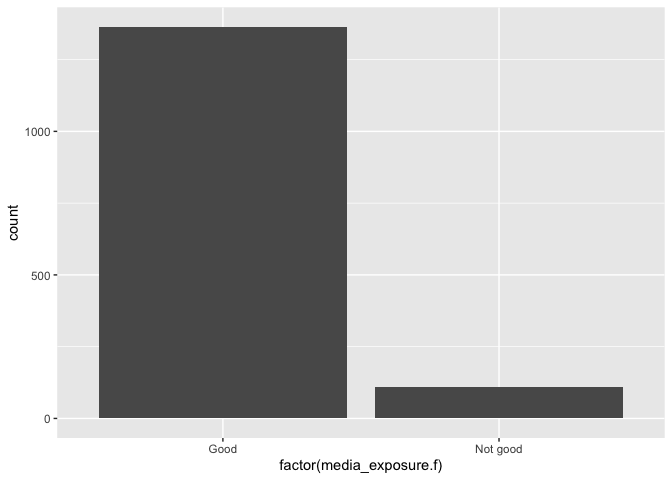<!-- -->

<table>
<thead>
<tr>
<th style="text-align:left;">
</th>
<th style="text-align:right;">
0
</th>
<th style="text-align:right;">
1
</th>
</tr>
</thead>
<tbody>
<tr>
<td style="text-align:left;">
Good
</td>
<td style="text-align:right;">
555
</td>
<td style="text-align:right;">
809
</td>
</tr>
<tr>
<td style="text-align:left;">
Not good
</td>
<td style="text-align:right;">
74
</td>
<td style="text-align:right;">
35
</td>
</tr>
</tbody>
</table>

The sample of woman mostly have good media exposure. Those with good
media exposure use contraception more. Those with not good media
exposure do not use contraception as much.

Media exposure is statistically related to contraceptive use.

<table style="border-collapse:collapse; border:none;">
<tr>
<th style="border-top: double; text-align:center; font-style:normal; font-weight:bold; padding:0.2cm;  text-align:left; ">
 
</th>
<th colspan="4" style="border-top: double; text-align:center; font-style:normal; font-weight:bold; padding:0.2cm; ">
contra.f
</th>
</tr>
<tr>
<td style=" text-align:center; border-bottom:1px solid; font-style:italic; font-weight:normal;  text-align:left; ">
Predictors
</td>
<td style=" text-align:center; border-bottom:1px solid; font-style:italic; font-weight:normal;  ">
Odds Ratios
</td>
<td style=" text-align:center; border-bottom:1px solid; font-style:italic; font-weight:normal;  ">
std. Error
</td>
<td style=" text-align:center; border-bottom:1px solid; font-style:italic; font-weight:normal;  ">
CI
</td>
<td style=" text-align:center; border-bottom:1px solid; font-style:italic; font-weight:normal;  ">
p
</td>
</tr>
<tr>
<td style=" padding:0.2cm; text-align:left; vertical-align:top; text-align:left; ">
(Intercept)
</td>
<td style=" padding:0.2cm; text-align:left; vertical-align:top; text-align:center;  ">
1.46
</td>
<td style=" padding:0.2cm; text-align:left; vertical-align:top; text-align:center;  ">
0.08
</td>
<td style=" padding:0.2cm; text-align:left; vertical-align:top; text-align:center;  ">
1.31 – 1.62
</td>
<td style=" padding:0.2cm; text-align:left; vertical-align:top; text-align:center;  ">
<strong>\<0.001</strong>
</td>
</tr>
<tr>
<td style=" padding:0.2cm; text-align:left; vertical-align:top; text-align:left; ">
media exposure f \[Not good\]
</td>
<td style=" padding:0.2cm; text-align:left; vertical-align:top; text-align:center;  ">
0.32
</td>
<td style=" padding:0.2cm; text-align:left; vertical-align:top; text-align:center;  ">
0.07
</td>
<td style=" padding:0.2cm; text-align:left; vertical-align:top; text-align:center;  ">
0.21 – 0.49
</td>
<td style=" padding:0.2cm; text-align:left; vertical-align:top; text-align:center;  ">
<strong>\<0.001</strong>
</td>
</tr>
<tr>
<td style=" padding:0.2cm; text-align:left; vertical-align:top; text-align:left; padding-top:0.1cm; padding-bottom:0.1cm; border-top:1px solid;">
Observations
</td>
<td style=" padding:0.2cm; text-align:left; vertical-align:top; padding-top:0.1cm; padding-bottom:0.1cm; text-align:left; border-top:1px solid;" colspan="4">
1473
</td>
</tr>
<tr>
<td style=" padding:0.2cm; text-align:left; vertical-align:top; text-align:left; padding-top:0.1cm; padding-bottom:0.1cm;">
R2 Tjur
</td>
<td style=" padding:0.2cm; text-align:left; vertical-align:top; padding-top:0.1cm; padding-bottom:0.1cm; text-align:left;" colspan="4">
0.021
</td>
</tr>
<tr>
<td style=" padding:0.2cm; text-align:left; vertical-align:top; text-align:left; padding-top:0.1cm; padding-bottom:0.1cm;">
AIC
</td>
<td style=" padding:0.2cm; text-align:left; vertical-align:top; padding-top:0.1cm; padding-bottom:0.1cm; text-align:left;" colspan="4">
1984.167
</td>
</tr>
</table>

Media exposure is statistically related to contraceptive use.

### Table 3: Final Model Selection, Confounding/Effect Modification, Diagnostics

I wanted to run a model with all variables and no transformation
(all_model) to see how it compares to the other model where I performed
variable selection by univariate analysis (test_model).

#### Model Selection

**Model with all predictors versus**

**Model with all predictors versus Model with selected predictors and
transformation**
<table style="border-collapse:collapse; border:none;">
<tr>
<th style="border-top: double; text-align:center; font-style:normal; font-weight:bold; padding:0.2cm;  text-align:left; ">
 
</th>
<th colspan="3" style="border-top: double; text-align:center; font-style:normal; font-weight:bold; padding:0.2cm; ">
contra.f
</th>
<th colspan="3" style="border-top: double; text-align:center; font-style:normal; font-weight:bold; padding:0.2cm; ">
contra.f
</th>
</tr>
<tr>
<td style=" text-align:center; border-bottom:1px solid; font-style:italic; font-weight:normal;  text-align:left; ">
Predictors
</td>
<td style=" text-align:center; border-bottom:1px solid; font-style:italic; font-weight:normal;  ">
Odds Ratios
</td>
<td style=" text-align:center; border-bottom:1px solid; font-style:italic; font-weight:normal;  ">
CI
</td>
<td style=" text-align:center; border-bottom:1px solid; font-style:italic; font-weight:normal;  ">
p
</td>
<td style=" text-align:center; border-bottom:1px solid; font-style:italic; font-weight:normal;  ">
Odds Ratios
</td>
<td style=" text-align:center; border-bottom:1px solid; font-style:italic; font-weight:normal;  ">
CI
</td>
<td style=" text-align:center; border-bottom:1px solid; font-style:italic; font-weight:normal;  col7">
p
</td>
</tr>
<tr>
<td style=" padding:0.2cm; text-align:left; vertical-align:top; text-align:left; ">
(Intercept)
</td>
<td style=" padding:0.2cm; text-align:left; vertical-align:top; text-align:center;  ">
0.10
</td>
<td style=" padding:0.2cm; text-align:left; vertical-align:top; text-align:center;  ">
0.04 – 0.28
</td>
<td style=" padding:0.2cm; text-align:left; vertical-align:top; text-align:center;  ">
<strong>\<0.001</strong>
</td>
<td style=" padding:0.2cm; text-align:left; vertical-align:top; text-align:center;  ">
0.26
</td>
<td style=" padding:0.2cm; text-align:left; vertical-align:top; text-align:center;  ">
0.10 – 0.65
</td>
<td style=" padding:0.2cm; text-align:left; vertical-align:top; text-align:center;  col7">
<strong>0.004</strong>
</td>
</tr>
<tr>
<td style=" padding:0.2cm; text-align:left; vertical-align:top; text-align:left; ">
wife age c
</td>
<td style=" padding:0.2cm; text-align:left; vertical-align:top; text-align:center;  ">
0.92
</td>
<td style=" padding:0.2cm; text-align:left; vertical-align:top; text-align:center;  ">
0.90 – 0.94
</td>
<td style=" padding:0.2cm; text-align:left; vertical-align:top; text-align:center;  ">
<strong>\<0.001</strong>
</td>
<td style=" padding:0.2cm; text-align:left; vertical-align:top; text-align:center;  ">
</td>
<td style=" padding:0.2cm; text-align:left; vertical-align:top; text-align:center;  ">
</td>
<td style=" padding:0.2cm; text-align:left; vertical-align:top; text-align:center;  col7">
</td>
</tr>
<tr>
<td style=" padding:0.2cm; text-align:left; vertical-align:top; text-align:left; ">
wife education f \[Some education\]
</td>
<td style=" padding:0.2cm; text-align:left; vertical-align:top; text-align:center;  ">
1.38
</td>
<td style=" padding:0.2cm; text-align:left; vertical-align:top; text-align:center;  ">
0.86 – 2.22
</td>
<td style=" padding:0.2cm; text-align:left; vertical-align:top; text-align:center;  ">
0.184
</td>
<td style=" padding:0.2cm; text-align:left; vertical-align:top; text-align:center;  ">
1.55
</td>
<td style=" padding:0.2cm; text-align:left; vertical-align:top; text-align:center;  ">
0.98 – 2.44
</td>
<td style=" padding:0.2cm; text-align:left; vertical-align:top; text-align:center;  col7">
0.060
</td>
</tr>
<tr>
<td style=" padding:0.2cm; text-align:left; vertical-align:top; text-align:left; ">
wife education f \[Educated\]
</td>
<td style=" padding:0.2cm; text-align:left; vertical-align:top; text-align:center;  ">
2.18
</td>
<td style=" padding:0.2cm; text-align:left; vertical-align:top; text-align:center;  ">
1.33 – 3.59
</td>
<td style=" padding:0.2cm; text-align:left; vertical-align:top; text-align:center;  ">
<strong>0.002</strong>
</td>
<td style=" padding:0.2cm; text-align:left; vertical-align:top; text-align:center;  ">
2.45
</td>
<td style=" padding:0.2cm; text-align:left; vertical-align:top; text-align:center;  ">
1.54 – 3.95
</td>
<td style=" padding:0.2cm; text-align:left; vertical-align:top; text-align:center;  col7">
<strong>\<0.001</strong>
</td>
</tr>
<tr>
<td style=" padding:0.2cm; text-align:left; vertical-align:top; text-align:left; ">
wife education f \[Higher education\]
</td>
<td style=" padding:0.2cm; text-align:left; vertical-align:top; text-align:center;  ">
4.67
</td>
<td style=" padding:0.2cm; text-align:left; vertical-align:top; text-align:center;  ">
2.74 – 8.03
</td>
<td style=" padding:0.2cm; text-align:left; vertical-align:top; text-align:center;  ">
<strong>\<0.001</strong>
</td>
<td style=" padding:0.2cm; text-align:left; vertical-align:top; text-align:center;  ">
4.28
</td>
<td style=" padding:0.2cm; text-align:left; vertical-align:top; text-align:center;  ">
2.59 – 7.11
</td>
<td style=" padding:0.2cm; text-align:left; vertical-align:top; text-align:center;  col7">
<strong>\<0.001</strong>
</td>
</tr>
<tr>
<td style=" padding:0.2cm; text-align:left; vertical-align:top; text-align:left; ">
husband education f \[Some education\]
</td>
<td style=" padding:0.2cm; text-align:left; vertical-align:top; text-align:center;  ">
1.38
</td>
<td style=" padding:0.2cm; text-align:left; vertical-align:top; text-align:center;  ">
0.64 – 3.09
</td>
<td style=" padding:0.2cm; text-align:left; vertical-align:top; text-align:center;  ">
0.425
</td>
<td style=" padding:0.2cm; text-align:left; vertical-align:top; text-align:center;  ">
1.47
</td>
<td style=" padding:0.2cm; text-align:left; vertical-align:top; text-align:center;  ">
0.69 – 3.24
</td>
<td style=" padding:0.2cm; text-align:left; vertical-align:top; text-align:center;  col7">
0.323
</td>
</tr>
<tr>
<td style=" padding:0.2cm; text-align:left; vertical-align:top; text-align:left; ">
husband education f \[Educated\]
</td>
<td style=" padding:0.2cm; text-align:left; vertical-align:top; text-align:center;  ">
1.56
</td>
<td style=" padding:0.2cm; text-align:left; vertical-align:top; text-align:center;  ">
0.73 – 3.44
</td>
<td style=" padding:0.2cm; text-align:left; vertical-align:top; text-align:center;  ">
0.260
</td>
<td style=" padding:0.2cm; text-align:left; vertical-align:top; text-align:center;  ">
1.57
</td>
<td style=" padding:0.2cm; text-align:left; vertical-align:top; text-align:center;  ">
0.75 – 3.39
</td>
<td style=" padding:0.2cm; text-align:left; vertical-align:top; text-align:center;  col7">
0.241
</td>
</tr>
<tr>
<td style=" padding:0.2cm; text-align:left; vertical-align:top; text-align:left; ">
husband education f \[Higher education\]
</td>
<td style=" padding:0.2cm; text-align:left; vertical-align:top; text-align:center;  ">
1.31
</td>
<td style=" padding:0.2cm; text-align:left; vertical-align:top; text-align:center;  ">
0.61 – 2.92
</td>
<td style=" padding:0.2cm; text-align:left; vertical-align:top; text-align:center;  ">
0.500
</td>
<td style=" padding:0.2cm; text-align:left; vertical-align:top; text-align:center;  ">
1.34
</td>
<td style=" padding:0.2cm; text-align:left; vertical-align:top; text-align:center;  ">
0.64 – 2.93
</td>
<td style=" padding:0.2cm; text-align:left; vertical-align:top; text-align:center;  col7">
0.449
</td>
</tr>
<tr>
<td style=" padding:0.2cm; text-align:left; vertical-align:top; text-align:left; ">
Number of Children
</td>
<td style=" padding:0.2cm; text-align:left; vertical-align:top; text-align:center;  ">
1.41
</td>
<td style=" padding:0.2cm; text-align:left; vertical-align:top; text-align:center;  ">
1.32 – 1.52
</td>
<td style=" padding:0.2cm; text-align:left; vertical-align:top; text-align:center;  ">
<strong>\<0.001</strong>
</td>
<td style=" padding:0.2cm; text-align:left; vertical-align:top; text-align:center;  ">
1.19
</td>
<td style=" padding:0.2cm; text-align:left; vertical-align:top; text-align:center;  ">
1.14 – 1.26
</td>
<td style=" padding:0.2cm; text-align:left; vertical-align:top; text-align:center;  col7">
<strong>\<0.001</strong>
</td>
</tr>
<tr>
<td style=" padding:0.2cm; text-align:left; vertical-align:top; text-align:left; ">
wife religion f \[Islam\]
</td>
<td style=" padding:0.2cm; text-align:left; vertical-align:top; text-align:center;  ">
0.64
</td>
<td style=" padding:0.2cm; text-align:left; vertical-align:top; text-align:center;  ">
0.45 – 0.90
</td>
<td style=" padding:0.2cm; text-align:left; vertical-align:top; text-align:center;  ">
<strong>0.011</strong>
</td>
<td style=" padding:0.2cm; text-align:left; vertical-align:top; text-align:center;  ">
0.94
</td>
<td style=" padding:0.2cm; text-align:left; vertical-align:top; text-align:center;  ">
0.68 – 1.30
</td>
<td style=" padding:0.2cm; text-align:left; vertical-align:top; text-align:center;  col7">
0.714
</td>
</tr>
<tr>
<td style=" padding:0.2cm; text-align:left; vertical-align:top; text-align:left; ">
wife working f \[No\]
</td>
<td style=" padding:0.2cm; text-align:left; vertical-align:top; text-align:center;  ">
1.14
</td>
<td style=" padding:0.2cm; text-align:left; vertical-align:top; text-align:center;  ">
0.88 – 1.49
</td>
<td style=" padding:0.2cm; text-align:left; vertical-align:top; text-align:center;  ">
0.312
</td>
<td style=" padding:0.2cm; text-align:left; vertical-align:top; text-align:center;  ">
</td>
<td style=" padding:0.2cm; text-align:left; vertical-align:top; text-align:center;  ">
</td>
<td style=" padding:0.2cm; text-align:left; vertical-align:top; text-align:center;  col7">
</td>
</tr>
<tr>
<td style=" padding:0.2cm; text-align:left; vertical-align:top; text-align:left; ">
husband occupation f \[2\]
</td>
<td style=" padding:0.2cm; text-align:left; vertical-align:top; text-align:center;  ">
0.83
</td>
<td style=" padding:0.2cm; text-align:left; vertical-align:top; text-align:center;  ">
0.59 – 1.15
</td>
<td style=" padding:0.2cm; text-align:left; vertical-align:top; text-align:center;  ">
0.251
</td>
<td style=" padding:0.2cm; text-align:left; vertical-align:top; text-align:center;  ">
</td>
<td style=" padding:0.2cm; text-align:left; vertical-align:top; text-align:center;  ">
</td>
<td style=" padding:0.2cm; text-align:left; vertical-align:top; text-align:center;  col7">
</td>
</tr>
<tr>
<td style=" padding:0.2cm; text-align:left; vertical-align:top; text-align:left; ">
husband occupation f \[3\]
</td>
<td style=" padding:0.2cm; text-align:left; vertical-align:top; text-align:center;  ">
1.08
</td>
<td style=" padding:0.2cm; text-align:left; vertical-align:top; text-align:center;  ">
0.78 – 1.49
</td>
<td style=" padding:0.2cm; text-align:left; vertical-align:top; text-align:center;  ">
0.656
</td>
<td style=" padding:0.2cm; text-align:left; vertical-align:top; text-align:center;  ">
</td>
<td style=" padding:0.2cm; text-align:left; vertical-align:top; text-align:center;  ">
</td>
<td style=" padding:0.2cm; text-align:left; vertical-align:top; text-align:center;  col7">
</td>
</tr>
<tr>
<td style=" padding:0.2cm; text-align:left; vertical-align:top; text-align:left; ">
husband occupation f \[4\]
</td>
<td style=" padding:0.2cm; text-align:left; vertical-align:top; text-align:center;  ">
1.64
</td>
<td style=" padding:0.2cm; text-align:left; vertical-align:top; text-align:center;  ">
0.67 – 4.02
</td>
<td style=" padding:0.2cm; text-align:left; vertical-align:top; text-align:center;  ">
0.277
</td>
<td style=" padding:0.2cm; text-align:left; vertical-align:top; text-align:center;  ">
</td>
<td style=" padding:0.2cm; text-align:left; vertical-align:top; text-align:center;  ">
</td>
<td style=" padding:0.2cm; text-align:left; vertical-align:top; text-align:center;  col7">
</td>
</tr>
<tr>
<td style=" padding:0.2cm; text-align:left; vertical-align:top; text-align:left; ">
sol f \[Low\]
</td>
<td style=" padding:0.2cm; text-align:left; vertical-align:top; text-align:center;  ">
1.50
</td>
<td style=" padding:0.2cm; text-align:left; vertical-align:top; text-align:center;  ">
0.94 – 2.42
</td>
<td style=" padding:0.2cm; text-align:left; vertical-align:top; text-align:center;  ">
0.094
</td>
<td style=" padding:0.2cm; text-align:left; vertical-align:top; text-align:center;  ">
1.22
</td>
<td style=" padding:0.2cm; text-align:left; vertical-align:top; text-align:center;  ">
0.77 – 1.97
</td>
<td style=" padding:0.2cm; text-align:left; vertical-align:top; text-align:center;  col7">
0.398
</td>
</tr>
<tr>
<td style=" padding:0.2cm; text-align:left; vertical-align:top; text-align:left; ">
sol f \[Medium\]
</td>
<td style=" padding:0.2cm; text-align:left; vertical-align:top; text-align:center;  ">
1.77
</td>
<td style=" padding:0.2cm; text-align:left; vertical-align:top; text-align:center;  ">
1.13 – 2.79
</td>
<td style=" padding:0.2cm; text-align:left; vertical-align:top; text-align:center;  ">
<strong>0.013</strong>
</td>
<td style=" padding:0.2cm; text-align:left; vertical-align:top; text-align:center;  ">
1.37
</td>
<td style=" padding:0.2cm; text-align:left; vertical-align:top; text-align:center;  ">
0.88 – 2.14
</td>
<td style=" padding:0.2cm; text-align:left; vertical-align:top; text-align:center;  col7">
0.166
</td>
</tr>
<tr>
<td style=" padding:0.2cm; text-align:left; vertical-align:top; text-align:left; ">
sol f \[High\]
</td>
<td style=" padding:0.2cm; text-align:left; vertical-align:top; text-align:center;  ">
2.28
</td>
<td style=" padding:0.2cm; text-align:left; vertical-align:top; text-align:center;  ">
1.45 – 3.61
</td>
<td style=" padding:0.2cm; text-align:left; vertical-align:top; text-align:center;  ">
<strong>\<0.001</strong>
</td>
<td style=" padding:0.2cm; text-align:left; vertical-align:top; text-align:center;  ">
1.50
</td>
<td style=" padding:0.2cm; text-align:left; vertical-align:top; text-align:center;  ">
0.97 – 2.34
</td>
<td style=" padding:0.2cm; text-align:left; vertical-align:top; text-align:center;  col7">
0.069
</td>
</tr>
<tr>
<td style=" padding:0.2cm; text-align:left; vertical-align:top; text-align:left; ">
media exposure f \[Not good\]
</td>
<td style=" padding:0.2cm; text-align:left; vertical-align:top; text-align:center;  ">
0.58
</td>
<td style=" padding:0.2cm; text-align:left; vertical-align:top; text-align:center;  ">
0.35 – 0.96
</td>
<td style=" padding:0.2cm; text-align:left; vertical-align:top; text-align:center;  ">
<strong>0.036</strong>
</td>
<td style=" padding:0.2cm; text-align:left; vertical-align:top; text-align:center;  ">
0.53
</td>
<td style=" padding:0.2cm; text-align:left; vertical-align:top; text-align:center;  ">
0.33 – 0.87
</td>
<td style=" padding:0.2cm; text-align:left; vertical-align:top; text-align:center;  col7">
<strong>0.012</strong>
</td>
</tr>
<tr>
<td style=" padding:0.2cm; text-align:left; vertical-align:top; text-align:left; ">
wife age c^2
</td>
<td style=" padding:0.2cm; text-align:left; vertical-align:top; text-align:center;  ">
</td>
<td style=" padding:0.2cm; text-align:left; vertical-align:top; text-align:center;  ">
</td>
<td style=" padding:0.2cm; text-align:left; vertical-align:top; text-align:center;  ">
</td>
<td style=" padding:0.2cm; text-align:left; vertical-align:top; text-align:center;  ">
0.99
</td>
<td style=" padding:0.2cm; text-align:left; vertical-align:top; text-align:center;  ">
0.99 – 1.00
</td>
<td style=" padding:0.2cm; text-align:left; vertical-align:top; text-align:center;  col7">
<strong>\<0.001</strong>
</td>
</tr>
<tr>
<td style=" padding:0.2cm; text-align:left; vertical-align:top; text-align:left; padding-top:0.1cm; padding-bottom:0.1cm; border-top:1px solid;">
Observations
</td>
<td style=" padding:0.2cm; text-align:left; vertical-align:top; padding-top:0.1cm; padding-bottom:0.1cm; text-align:left; border-top:1px solid;" colspan="3">
1473
</td>
<td style=" padding:0.2cm; text-align:left; vertical-align:top; padding-top:0.1cm; padding-bottom:0.1cm; text-align:left; border-top:1px solid;" colspan="3">
1473
</td>
</tr>
<tr>
<td style=" padding:0.2cm; text-align:left; vertical-align:top; text-align:left; padding-top:0.1cm; padding-bottom:0.1cm;">
R2 Tjur
</td>
<td style=" padding:0.2cm; text-align:left; vertical-align:top; padding-top:0.1cm; padding-bottom:0.1cm; text-align:left;" colspan="3">
0.159
</td>
<td style=" padding:0.2cm; text-align:left; vertical-align:top; padding-top:0.1cm; padding-bottom:0.1cm; text-align:left;" colspan="3">
0.133
</td>
</tr>
<tr>
<td style=" padding:0.2cm; text-align:left; vertical-align:top; text-align:left; padding-top:0.1cm; padding-bottom:0.1cm;">
AIC
</td>
<td style=" padding:0.2cm; text-align:left; vertical-align:top; padding-top:0.1cm; padding-bottom:0.1cm; text-align:left;" colspan="3">
1798.618
</td>
<td style=" padding:0.2cm; text-align:left; vertical-align:top; padding-top:0.1cm; padding-bottom:0.1cm; text-align:left;" colspan="3">
24740.310
</td>
</tr>
</table>

Even after examining the predictors independently, the model with that
selection and transformation of wife_age.c2 is worse than the
model with all the predictors. The AIC of the full model is 1798 while
the test model is 24740.

**Model with all predictors versus Model with with selected predictors
(no age transformation)**
<table style="border-collapse:collapse; border:none;">
<tr>
<th style="border-top: double; text-align:center; font-style:normal; font-weight:bold; padding:0.2cm;  text-align:left; ">
 
</th>
<th colspan="3" style="border-top: double; text-align:center; font-style:normal; font-weight:bold; padding:0.2cm; ">
contra.f
</th>
<th colspan="3" style="border-top: double; text-align:center; font-style:normal; font-weight:bold; padding:0.2cm; ">
contra.f
</th>
</tr>
<tr>
<td style=" text-align:center; border-bottom:1px solid; font-style:italic; font-weight:normal;  text-align:left; ">
Predictors
</td>
<td style=" text-align:center; border-bottom:1px solid; font-style:italic; font-weight:normal;  ">
Odds Ratios
</td>
<td style=" text-align:center; border-bottom:1px solid; font-style:italic; font-weight:normal;  ">
CI
</td>
<td style=" text-align:center; border-bottom:1px solid; font-style:italic; font-weight:normal;  ">
p
</td>
<td style=" text-align:center; border-bottom:1px solid; font-style:italic; font-weight:normal;  ">
Odds Ratios
</td>
<td style=" text-align:center; border-bottom:1px solid; font-style:italic; font-weight:normal;  ">
CI
</td>
<td style=" text-align:center; border-bottom:1px solid; font-style:italic; font-weight:normal;  col7">
p
</td>
</tr>
<tr>
<td style=" padding:0.2cm; text-align:left; vertical-align:top; text-align:left; ">
(Intercept)
</td>
<td style=" padding:0.2cm; text-align:left; vertical-align:top; text-align:center;  ">
0.10
</td>
<td style=" padding:0.2cm; text-align:left; vertical-align:top; text-align:center;  ">
0.04 – 0.28
</td>
<td style=" padding:0.2cm; text-align:left; vertical-align:top; text-align:center;  ">
<strong>\<0.001</strong>
</td>
<td style=" padding:0.2cm; text-align:left; vertical-align:top; text-align:center;  ">
0.15
</td>
<td style=" padding:0.2cm; text-align:left; vertical-align:top; text-align:center;  ">
0.08 – 0.30
</td>
<td style=" padding:0.2cm; text-align:left; vertical-align:top; text-align:center;  col7">
<strong>\<0.001</strong>
</td>
</tr>
<tr>
<td style=" padding:0.2cm; text-align:left; vertical-align:top; text-align:left; ">
wife age c
</td>
<td style=" padding:0.2cm; text-align:left; vertical-align:top; text-align:center;  ">
0.92
</td>
<td style=" padding:0.2cm; text-align:left; vertical-align:top; text-align:center;  ">
0.90 – 0.94
</td>
<td style=" padding:0.2cm; text-align:left; vertical-align:top; text-align:center;  ">
<strong>\<0.001</strong>
</td>
<td style=" padding:0.2cm; text-align:left; vertical-align:top; text-align:center;  ">
0.92
</td>
<td style=" padding:0.2cm; text-align:left; vertical-align:top; text-align:center;  ">
0.90 – 0.94
</td>
<td style=" padding:0.2cm; text-align:left; vertical-align:top; text-align:center;  col7">
<strong>\<0.001</strong>
</td>
</tr>
<tr>
<td style=" padding:0.2cm; text-align:left; vertical-align:top; text-align:left; ">
wife education f \[Some education\]
</td>
<td style=" padding:0.2cm; text-align:left; vertical-align:top; text-align:center;  ">
1.38
</td>
<td style=" padding:0.2cm; text-align:left; vertical-align:top; text-align:center;  ">
0.86 – 2.22
</td>
<td style=" padding:0.2cm; text-align:left; vertical-align:top; text-align:center;  ">
0.184
</td>
<td style=" padding:0.2cm; text-align:left; vertical-align:top; text-align:center;  ">
1.40
</td>
<td style=" padding:0.2cm; text-align:left; vertical-align:top; text-align:center;  ">
0.88 – 2.23
</td>
<td style=" padding:0.2cm; text-align:left; vertical-align:top; text-align:center;  col7">
0.155
</td>
</tr>
<tr>
<td style=" padding:0.2cm; text-align:left; vertical-align:top; text-align:left; ">
wife education f \[Educated\]
</td>
<td style=" padding:0.2cm; text-align:left; vertical-align:top; text-align:center;  ">
2.18
</td>
<td style=" padding:0.2cm; text-align:left; vertical-align:top; text-align:center;  ">
1.33 – 3.59
</td>
<td style=" padding:0.2cm; text-align:left; vertical-align:top; text-align:center;  ">
<strong>0.002</strong>
</td>
<td style=" padding:0.2cm; text-align:left; vertical-align:top; text-align:center;  ">
2.15
</td>
<td style=" padding:0.2cm; text-align:left; vertical-align:top; text-align:center;  ">
1.36 – 3.43
</td>
<td style=" padding:0.2cm; text-align:left; vertical-align:top; text-align:center;  col7">
<strong>0.001</strong>
</td>
</tr>
<tr>
<td style=" padding:0.2cm; text-align:left; vertical-align:top; text-align:left; ">
wife education f \[Higher education\]
</td>
<td style=" padding:0.2cm; text-align:left; vertical-align:top; text-align:center;  ">
4.67
</td>
<td style=" padding:0.2cm; text-align:left; vertical-align:top; text-align:center;  ">
2.74 – 8.03
</td>
<td style=" padding:0.2cm; text-align:left; vertical-align:top; text-align:center;  ">
<strong>\<0.001</strong>
</td>
<td style=" padding:0.2cm; text-align:left; vertical-align:top; text-align:center;  ">
4.36
</td>
<td style=" padding:0.2cm; text-align:left; vertical-align:top; text-align:center;  ">
2.74 – 7.01
</td>
<td style=" padding:0.2cm; text-align:left; vertical-align:top; text-align:center;  col7">
<strong>\<0.001</strong>
</td>
</tr>
<tr>
<td style=" padding:0.2cm; text-align:left; vertical-align:top; text-align:left; ">
husband education f \[Some education\]
</td>
<td style=" padding:0.2cm; text-align:left; vertical-align:top; text-align:center;  ">
1.38
</td>
<td style=" padding:0.2cm; text-align:left; vertical-align:top; text-align:center;  ">
0.64 – 3.09
</td>
<td style=" padding:0.2cm; text-align:left; vertical-align:top; text-align:center;  ">
0.425
</td>
<td style=" padding:0.2cm; text-align:left; vertical-align:top; text-align:center;  ">
</td>
<td style=" padding:0.2cm; text-align:left; vertical-align:top; text-align:center;  ">
</td>
<td style=" padding:0.2cm; text-align:left; vertical-align:top; text-align:center;  col7">
</td>
</tr>
<tr>
<td style=" padding:0.2cm; text-align:left; vertical-align:top; text-align:left; ">
husband education f \[Educated\]
</td>
<td style=" padding:0.2cm; text-align:left; vertical-align:top; text-align:center;  ">
1.56
</td>
<td style=" padding:0.2cm; text-align:left; vertical-align:top; text-align:center;  ">
0.73 – 3.44
</td>
<td style=" padding:0.2cm; text-align:left; vertical-align:top; text-align:center;  ">
0.260
</td>
<td style=" padding:0.2cm; text-align:left; vertical-align:top; text-align:center;  ">
</td>
<td style=" padding:0.2cm; text-align:left; vertical-align:top; text-align:center;  ">
</td>
<td style=" padding:0.2cm; text-align:left; vertical-align:top; text-align:center;  col7">
</td>
</tr>
<tr>
<td style=" padding:0.2cm; text-align:left; vertical-align:top; text-align:left; ">
husband education f \[Higher education\]
</td>
<td style=" padding:0.2cm; text-align:left; vertical-align:top; text-align:center;  ">
1.31
</td>
<td style=" padding:0.2cm; text-align:left; vertical-align:top; text-align:center;  ">
0.61 – 2.92
</td>
<td style=" padding:0.2cm; text-align:left; vertical-align:top; text-align:center;  ">
0.500
</td>
<td style=" padding:0.2cm; text-align:left; vertical-align:top; text-align:center;  ">
</td>
<td style=" padding:0.2cm; text-align:left; vertical-align:top; text-align:center;  ">
</td>
<td style=" padding:0.2cm; text-align:left; vertical-align:top; text-align:center;  col7">
</td>
</tr>
<tr>
<td style=" padding:0.2cm; text-align:left; vertical-align:top; text-align:left; ">
Number of Children
</td>
<td style=" padding:0.2cm; text-align:left; vertical-align:top; text-align:center;  ">
1.41
</td>
<td style=" padding:0.2cm; text-align:left; vertical-align:top; text-align:center;  ">
1.32 – 1.52
</td>
<td style=" padding:0.2cm; text-align:left; vertical-align:top; text-align:center;  ">
<strong>\<0.001</strong>
</td>
<td style=" padding:0.2cm; text-align:left; vertical-align:top; text-align:center;  ">
1.41
</td>
<td style=" padding:0.2cm; text-align:left; vertical-align:top; text-align:center;  ">
1.32 – 1.51
</td>
<td style=" padding:0.2cm; text-align:left; vertical-align:top; text-align:center;  col7">
<strong>\<0.001</strong>
</td>
</tr>
<tr>
<td style=" padding:0.2cm; text-align:left; vertical-align:top; text-align:left; ">
wife religion f \[Islam\]
</td>
<td style=" padding:0.2cm; text-align:left; vertical-align:top; text-align:center;  ">
0.64
</td>
<td style=" padding:0.2cm; text-align:left; vertical-align:top; text-align:center;  ">
0.45 – 0.90
</td>
<td style=" padding:0.2cm; text-align:left; vertical-align:top; text-align:center;  ">
<strong>0.011</strong>
</td>
<td style=" padding:0.2cm; text-align:left; vertical-align:top; text-align:center;  ">
0.67
</td>
<td style=" padding:0.2cm; text-align:left; vertical-align:top; text-align:center;  ">
0.48 – 0.93
</td>
<td style=" padding:0.2cm; text-align:left; vertical-align:top; text-align:center;  col7">
<strong>0.019</strong>
</td>
</tr>
<tr>
<td style=" padding:0.2cm; text-align:left; vertical-align:top; text-align:left; ">
wife working f \[No\]
</td>
<td style=" padding:0.2cm; text-align:left; vertical-align:top; text-align:center;  ">
1.14
</td>
<td style=" padding:0.2cm; text-align:left; vertical-align:top; text-align:center;  ">
0.88 – 1.49
</td>
<td style=" padding:0.2cm; text-align:left; vertical-align:top; text-align:center;  ">
0.312
</td>
<td style=" padding:0.2cm; text-align:left; vertical-align:top; text-align:center;  ">
</td>
<td style=" padding:0.2cm; text-align:left; vertical-align:top; text-align:center;  ">
</td>
<td style=" padding:0.2cm; text-align:left; vertical-align:top; text-align:center;  col7">
</td>
</tr>
<tr>
<td style=" padding:0.2cm; text-align:left; vertical-align:top; text-align:left; ">
husband occupation f \[2\]
</td>
<td style=" padding:0.2cm; text-align:left; vertical-align:top; text-align:center;  ">
0.83
</td>
<td style=" padding:0.2cm; text-align:left; vertical-align:top; text-align:center;  ">
0.59 – 1.15
</td>
<td style=" padding:0.2cm; text-align:left; vertical-align:top; text-align:center;  ">
0.251
</td>
<td style=" padding:0.2cm; text-align:left; vertical-align:top; text-align:center;  ">
</td>
<td style=" padding:0.2cm; text-align:left; vertical-align:top; text-align:center;  ">
</td>
<td style=" padding:0.2cm; text-align:left; vertical-align:top; text-align:center;  col7">
</td>
</tr>
<tr>
<td style=" padding:0.2cm; text-align:left; vertical-align:top; text-align:left; ">
husband occupation f \[3\]
</td>
<td style=" padding:0.2cm; text-align:left; vertical-align:top; text-align:center;  ">
1.08
</td>
<td style=" padding:0.2cm; text-align:left; vertical-align:top; text-align:center;  ">
0.78 – 1.49
</td>
<td style=" padding:0.2cm; text-align:left; vertical-align:top; text-align:center;  ">
0.656
</td>
<td style=" padding:0.2cm; text-align:left; vertical-align:top; text-align:center;  ">
</td>
<td style=" padding:0.2cm; text-align:left; vertical-align:top; text-align:center;  ">
</td>
<td style=" padding:0.2cm; text-align:left; vertical-align:top; text-align:center;  col7">
</td>
</tr>
<tr>
<td style=" padding:0.2cm; text-align:left; vertical-align:top; text-align:left; ">
husband occupation f \[4\]
</td>
<td style=" padding:0.2cm; text-align:left; vertical-align:top; text-align:center;  ">
1.64
</td>
<td style=" padding:0.2cm; text-align:left; vertical-align:top; text-align:center;  ">
0.67 – 4.02
</td>
<td style=" padding:0.2cm; text-align:left; vertical-align:top; text-align:center;  ">
0.277
</td>
<td style=" padding:0.2cm; text-align:left; vertical-align:top; text-align:center;  ">
</td>
<td style=" padding:0.2cm; text-align:left; vertical-align:top; text-align:center;  ">
</td>
<td style=" padding:0.2cm; text-align:left; vertical-align:top; text-align:center;  col7">
</td>
</tr>
<tr>
<td style=" padding:0.2cm; text-align:left; vertical-align:top; text-align:left; ">
sol f \[Low\]
</td>
<td style=" padding:0.2cm; text-align:left; vertical-align:top; text-align:center;  ">
1.50
</td>
<td style=" padding:0.2cm; text-align:left; vertical-align:top; text-align:center;  ">
0.94 – 2.42
</td>
<td style=" padding:0.2cm; text-align:left; vertical-align:top; text-align:center;  ">
0.094
</td>
<td style=" padding:0.2cm; text-align:left; vertical-align:top; text-align:center;  ">
1.48
</td>
<td style=" padding:0.2cm; text-align:left; vertical-align:top; text-align:center;  ">
0.93 – 2.38
</td>
<td style=" padding:0.2cm; text-align:left; vertical-align:top; text-align:center;  col7">
0.102
</td>
</tr>
<tr>
<td style=" padding:0.2cm; text-align:left; vertical-align:top; text-align:left; ">
sol f \[Medium\]
</td>
<td style=" padding:0.2cm; text-align:left; vertical-align:top; text-align:center;  ">
1.77
</td>
<td style=" padding:0.2cm; text-align:left; vertical-align:top; text-align:center;  ">
1.13 – 2.79
</td>
<td style=" padding:0.2cm; text-align:left; vertical-align:top; text-align:center;  ">
<strong>0.013</strong>
</td>
<td style=" padding:0.2cm; text-align:left; vertical-align:top; text-align:center;  ">
1.74
</td>
<td style=" padding:0.2cm; text-align:left; vertical-align:top; text-align:center;  ">
1.12 – 2.73
</td>
<td style=" padding:0.2cm; text-align:left; vertical-align:top; text-align:center;  col7">
<strong>0.014</strong>
</td>
</tr>
<tr>
<td style=" padding:0.2cm; text-align:left; vertical-align:top; text-align:left; ">
sol f \[High\]
</td>
<td style=" padding:0.2cm; text-align:left; vertical-align:top; text-align:center;  ">
2.28
</td>
<td style=" padding:0.2cm; text-align:left; vertical-align:top; text-align:center;  ">
1.45 – 3.61
</td>
<td style=" padding:0.2cm; text-align:left; vertical-align:top; text-align:center;  ">
<strong>\<0.001</strong>
</td>
<td style=" padding:0.2cm; text-align:left; vertical-align:top; text-align:center;  ">
2.22
</td>
<td style=" padding:0.2cm; text-align:left; vertical-align:top; text-align:center;  ">
1.43 – 3.49
</td>
<td style=" padding:0.2cm; text-align:left; vertical-align:top; text-align:center;  col7">
<strong>\<0.001</strong>
</td>
</tr>
<tr>
<td style=" padding:0.2cm; text-align:left; vertical-align:top; text-align:left; ">
media exposure f \[Not good\]
</td>
<td style=" padding:0.2cm; text-align:left; vertical-align:top; text-align:center;  ">
0.58
</td>
<td style=" padding:0.2cm; text-align:left; vertical-align:top; text-align:center;  ">
0.35 – 0.96
</td>
<td style=" padding:0.2cm; text-align:left; vertical-align:top; text-align:center;  ">
<strong>0.036</strong>
</td>
<td style=" padding:0.2cm; text-align:left; vertical-align:top; text-align:center;  ">
0.57
</td>
<td style=" padding:0.2cm; text-align:left; vertical-align:top; text-align:center;  ">
0.35 – 0.94
</td>
<td style=" padding:0.2cm; text-align:left; vertical-align:top; text-align:center;  col7">
<strong>0.029</strong>
</td>
</tr>
<tr>
<td style=" padding:0.2cm; text-align:left; vertical-align:top; text-align:left; padding-top:0.1cm; padding-bottom:0.1cm; border-top:1px solid;">
Observations
</td>
<td style=" padding:0.2cm; text-align:left; vertical-align:top; padding-top:0.1cm; padding-bottom:0.1cm; text-align:left; border-top:1px solid;" colspan="3">
1473
</td>
<td style=" padding:0.2cm; text-align:left; vertical-align:top; padding-top:0.1cm; padding-bottom:0.1cm; text-align:left; border-top:1px solid;" colspan="3">
1473
</td>
</tr>
<tr>
<td style=" padding:0.2cm; text-align:left; vertical-align:top; text-align:left; padding-top:0.1cm; padding-bottom:0.1cm;">
R2 Tjur
</td>
<td style=" padding:0.2cm; text-align:left; vertical-align:top; padding-top:0.1cm; padding-bottom:0.1cm; text-align:left;" colspan="3">
0.159
</td>
<td style=" padding:0.2cm; text-align:left; vertical-align:top; padding-top:0.1cm; padding-bottom:0.1cm; text-align:left;" colspan="3">
0.154
</td>
</tr>
<tr>
<td style=" padding:0.2cm; text-align:left; vertical-align:top; text-align:left; padding-top:0.1cm; padding-bottom:0.1cm;">
AIC
</td>
<td style=" padding:0.2cm; text-align:left; vertical-align:top; padding-top:0.1cm; padding-bottom:0.1cm; text-align:left;" colspan="3">
1798.618
</td>
<td style=" padding:0.2cm; text-align:left; vertical-align:top; padding-top:0.1cm; padding-bottom:0.1cm; text-align:left;" colspan="3">
1792.611
</td>
</tr>
</table>

I performed another model with the linear term of wife_age.c instead of
squared and the AIC is now 1792. Before I finalized my model, I observed
confounding and effect modifiers.

 

#### Examining demographic confounding

The criteria for confounding is at least a 10% change in estimates and
variables must be sensibly a cause to both X and Y.

#### 1. Wife’s Age

**Model without wife’s age versus with wife’s age**
<table style="border-collapse:collapse; border:none;">
<tr>
<th style="border-top: double; text-align:center; font-style:normal; font-weight:bold; padding:0.2cm;  text-align:left; ">
 
</th>
<th colspan="3" style="border-top: double; text-align:center; font-style:normal; font-weight:bold; padding:0.2cm; ">
contra.f
</th>
<th colspan="3" style="border-top: double; text-align:center; font-style:normal; font-weight:bold; padding:0.2cm; ">
contra.f
</th>
</tr>
<tr>
<td style=" text-align:center; border-bottom:1px solid; font-style:italic; font-weight:normal;  text-align:left; ">
Predictors
</td>
<td style=" text-align:center; border-bottom:1px solid; font-style:italic; font-weight:normal;  ">
Odds Ratios
</td>
<td style=" text-align:center; border-bottom:1px solid; font-style:italic; font-weight:normal;  ">
CI
</td>
<td style=" text-align:center; border-bottom:1px solid; font-style:italic; font-weight:normal;  ">
p
</td>
<td style=" text-align:center; border-bottom:1px solid; font-style:italic; font-weight:normal;  ">
Odds Ratios
</td>
<td style=" text-align:center; border-bottom:1px solid; font-style:italic; font-weight:normal;  ">
CI
</td>
<td style=" text-align:center; border-bottom:1px solid; font-style:italic; font-weight:normal;  col7">
p
</td>
</tr>
<tr>
<td style=" padding:0.2cm; text-align:left; vertical-align:top; text-align:left; ">
(Intercept)
</td>
<td style=" padding:0.2cm; text-align:left; vertical-align:top; text-align:center;  ">
0.22
</td>
<td style=" padding:0.2cm; text-align:left; vertical-align:top; text-align:center;  ">
0.11 – 0.42
</td>
<td style=" padding:0.2cm; text-align:left; vertical-align:top; text-align:center;  ">
<strong>\<0.001</strong>
</td>
<td style=" padding:0.2cm; text-align:left; vertical-align:top; text-align:center;  ">
0.15
</td>
<td style=" padding:0.2cm; text-align:left; vertical-align:top; text-align:center;  ">
0.08 – 0.30
</td>
<td style=" padding:0.2cm; text-align:left; vertical-align:top; text-align:center;  col7">
<strong>\<0.001</strong>
</td>
</tr>
<tr>
<td style=" padding:0.2cm; text-align:left; vertical-align:top; text-align:left; ">
wife education f \[Some education\]
</td>
<td style=" padding:0.2cm; text-align:left; vertical-align:top; text-align:center;  ">
1.90
</td>
<td style=" padding:0.2cm; text-align:left; vertical-align:top; text-align:center;  ">
1.23 – 2.95
</td>
<td style=" padding:0.2cm; text-align:left; vertical-align:top; text-align:center;  ">
<strong>0.004</strong>
</td>
<td style=" padding:0.2cm; text-align:left; vertical-align:top; text-align:center;  ">
1.40
</td>
<td style=" padding:0.2cm; text-align:left; vertical-align:top; text-align:center;  ">
0.88 – 2.23
</td>
<td style=" padding:0.2cm; text-align:left; vertical-align:top; text-align:center;  col7">
0.155
</td>
</tr>
<tr>
<td style=" padding:0.2cm; text-align:left; vertical-align:top; text-align:left; ">
wife education f \[Educated\]
</td>
<td style=" padding:0.2cm; text-align:left; vertical-align:top; text-align:center;  ">
2.85
</td>
<td style=" padding:0.2cm; text-align:left; vertical-align:top; text-align:center;  ">
1.85 – 4.42
</td>
<td style=" padding:0.2cm; text-align:left; vertical-align:top; text-align:center;  ">
<strong>\<0.001</strong>
</td>
<td style=" padding:0.2cm; text-align:left; vertical-align:top; text-align:center;  ">
2.15
</td>
<td style=" padding:0.2cm; text-align:left; vertical-align:top; text-align:center;  ">
1.36 – 3.43
</td>
<td style=" padding:0.2cm; text-align:left; vertical-align:top; text-align:center;  col7">
<strong>0.001</strong>
</td>
</tr>
<tr>
<td style=" padding:0.2cm; text-align:left; vertical-align:top; text-align:left; ">
wife education f \[Higher education\]
</td>
<td style=" padding:0.2cm; text-align:left; vertical-align:top; text-align:center;  ">
4.78
</td>
<td style=" padding:0.2cm; text-align:left; vertical-align:top; text-align:center;  ">
3.07 – 7.52
</td>
<td style=" padding:0.2cm; text-align:left; vertical-align:top; text-align:center;  ">
<strong>\<0.001</strong>
</td>
<td style=" padding:0.2cm; text-align:left; vertical-align:top; text-align:center;  ">
4.36
</td>
<td style=" padding:0.2cm; text-align:left; vertical-align:top; text-align:center;  ">
2.74 – 7.01
</td>
<td style=" padding:0.2cm; text-align:left; vertical-align:top; text-align:center;  col7">
<strong>\<0.001</strong>
</td>
</tr>
<tr>
<td style=" padding:0.2cm; text-align:left; vertical-align:top; text-align:left; ">
Number of Children
</td>
<td style=" padding:0.2cm; text-align:left; vertical-align:top; text-align:center;  ">
1.19
</td>
<td style=" padding:0.2cm; text-align:left; vertical-align:top; text-align:center;  ">
1.13 – 1.25
</td>
<td style=" padding:0.2cm; text-align:left; vertical-align:top; text-align:center;  ">
<strong>\<0.001</strong>
</td>
<td style=" padding:0.2cm; text-align:left; vertical-align:top; text-align:center;  ">
1.41
</td>
<td style=" padding:0.2cm; text-align:left; vertical-align:top; text-align:center;  ">
1.32 – 1.51
</td>
<td style=" padding:0.2cm; text-align:left; vertical-align:top; text-align:center;  col7">
<strong>\<0.001</strong>
</td>
</tr>
<tr>
<td style=" padding:0.2cm; text-align:left; vertical-align:top; text-align:left; ">
wife religion f \[Islam\]
</td>
<td style=" padding:0.2cm; text-align:left; vertical-align:top; text-align:center;  ">
0.90
</td>
<td style=" padding:0.2cm; text-align:left; vertical-align:top; text-align:center;  ">
0.65 – 1.23
</td>
<td style=" padding:0.2cm; text-align:left; vertical-align:top; text-align:center;  ">
0.506
</td>
<td style=" padding:0.2cm; text-align:left; vertical-align:top; text-align:center;  ">
0.67
</td>
<td style=" padding:0.2cm; text-align:left; vertical-align:top; text-align:center;  ">
0.48 – 0.93
</td>
<td style=" padding:0.2cm; text-align:left; vertical-align:top; text-align:center;  col7">
<strong>0.019</strong>
</td>
</tr>
<tr>
<td style=" padding:0.2cm; text-align:left; vertical-align:top; text-align:left; ">
sol f \[Low\]
</td>
<td style=" padding:0.2cm; text-align:left; vertical-align:top; text-align:center;  ">
1.31
</td>
<td style=" padding:0.2cm; text-align:left; vertical-align:top; text-align:center;  ">
0.83 – 2.08
</td>
<td style=" padding:0.2cm; text-align:left; vertical-align:top; text-align:center;  ">
0.247
</td>
<td style=" padding:0.2cm; text-align:left; vertical-align:top; text-align:center;  ">
1.48
</td>
<td style=" padding:0.2cm; text-align:left; vertical-align:top; text-align:center;  ">
0.93 – 2.38
</td>
<td style=" padding:0.2cm; text-align:left; vertical-align:top; text-align:center;  col7">
0.102
</td>
</tr>
<tr>
<td style=" padding:0.2cm; text-align:left; vertical-align:top; text-align:left; ">
sol f \[Medium\]
</td>
<td style=" padding:0.2cm; text-align:left; vertical-align:top; text-align:center;  ">
1.45
</td>
<td style=" padding:0.2cm; text-align:left; vertical-align:top; text-align:center;  ">
0.94 – 2.23
</td>
<td style=" padding:0.2cm; text-align:left; vertical-align:top; text-align:center;  ">
0.091
</td>
<td style=" padding:0.2cm; text-align:left; vertical-align:top; text-align:center;  ">
1.74
</td>
<td style=" padding:0.2cm; text-align:left; vertical-align:top; text-align:center;  ">
1.12 – 2.73
</td>
<td style=" padding:0.2cm; text-align:left; vertical-align:top; text-align:center;  col7">
<strong>0.014</strong>
</td>
</tr>
<tr>
<td style=" padding:0.2cm; text-align:left; vertical-align:top; text-align:left; ">
sol f \[High\]
</td>
<td style=" padding:0.2cm; text-align:left; vertical-align:top; text-align:center;  ">
1.55
</td>
<td style=" padding:0.2cm; text-align:left; vertical-align:top; text-align:center;  ">
1.02 – 2.39
</td>
<td style=" padding:0.2cm; text-align:left; vertical-align:top; text-align:center;  ">
<strong>0.043</strong>
</td>
<td style=" padding:0.2cm; text-align:left; vertical-align:top; text-align:center;  ">
2.22
</td>
<td style=" padding:0.2cm; text-align:left; vertical-align:top; text-align:center;  ">
1.43 – 3.49
</td>
<td style=" padding:0.2cm; text-align:left; vertical-align:top; text-align:center;  col7">
<strong>\<0.001</strong>
</td>
</tr>
<tr>
<td style=" padding:0.2cm; text-align:left; vertical-align:top; text-align:left; ">
media exposure f \[Not good\]
</td>
<td style=" padding:0.2cm; text-align:left; vertical-align:top; text-align:center;  ">
0.54
</td>
<td style=" padding:0.2cm; text-align:left; vertical-align:top; text-align:center;  ">
0.33 – 0.86
</td>
<td style=" padding:0.2cm; text-align:left; vertical-align:top; text-align:center;  ">
<strong>0.010</strong>
</td>
<td style=" padding:0.2cm; text-align:left; vertical-align:top; text-align:center;  ">
0.57
</td>
<td style=" padding:0.2cm; text-align:left; vertical-align:top; text-align:center;  ">
0.35 – 0.94
</td>
<td style=" padding:0.2cm; text-align:left; vertical-align:top; text-align:center;  col7">
<strong>0.029</strong>
</td>
</tr>
<tr>
<td style=" padding:0.2cm; text-align:left; vertical-align:top; text-align:left; ">
wife age c
</td>
<td style=" padding:0.2cm; text-align:left; vertical-align:top; text-align:center;  ">
</td>
<td style=" padding:0.2cm; text-align:left; vertical-align:top; text-align:center;  ">
</td>
<td style=" padding:0.2cm; text-align:left; vertical-align:top; text-align:center;  ">
</td>
<td style=" padding:0.2cm; text-align:left; vertical-align:top; text-align:center;  ">
0.92
</td>
<td style=" padding:0.2cm; text-align:left; vertical-align:top; text-align:center;  ">
0.90 – 0.94
</td>
<td style=" padding:0.2cm; text-align:left; vertical-align:top; text-align:center;  col7">
<strong>\<0.001</strong>
</td>
</tr>
<tr>
<td style=" padding:0.2cm; text-align:left; vertical-align:top; text-align:left; padding-top:0.1cm; padding-bottom:0.1cm; border-top:1px solid;">
Observations
</td>
<td style=" padding:0.2cm; text-align:left; vertical-align:top; padding-top:0.1cm; padding-bottom:0.1cm; text-align:left; border-top:1px solid;" colspan="3">
1473
</td>
<td style=" padding:0.2cm; text-align:left; vertical-align:top; padding-top:0.1cm; padding-bottom:0.1cm; text-align:left; border-top:1px solid;" colspan="3">
1473
</td>
</tr>
<tr>
<td style=" padding:0.2cm; text-align:left; vertical-align:top; text-align:left; padding-top:0.1cm; padding-bottom:0.1cm;">
R2 Tjur
</td>
<td style=" padding:0.2cm; text-align:left; vertical-align:top; padding-top:0.1cm; padding-bottom:0.1cm; text-align:left;" colspan="3">
0.100
</td>
<td style=" padding:0.2cm; text-align:left; vertical-align:top; padding-top:0.1cm; padding-bottom:0.1cm; text-align:left;" colspan="3">
0.154
</td>
</tr>
<tr>
<td style=" padding:0.2cm; text-align:left; vertical-align:top; text-align:left; padding-top:0.1cm; padding-bottom:0.1cm;">
AIC
</td>
<td style=" padding:0.2cm; text-align:left; vertical-align:top; padding-top:0.1cm; padding-bottom:0.1cm; text-align:left;" colspan="3">
1879.097
</td>
<td style=" padding:0.2cm; text-align:left; vertical-align:top; padding-top:0.1cm; padding-bottom:0.1cm; text-align:left;" colspan="3">
1792.611
</td>
</tr>
</table>

The are multiple beta % changes when wife’s age is added to the model.
Wife’s age is a confounder.

 

#### 2. Wife’s Education

**Model without wife’s education versus with wife’s education**
<table style="border-collapse:collapse; border:none;">
<tr>
<th style="border-top: double; text-align:center; font-style:normal; font-weight:bold; padding:0.2cm;  text-align:left; ">
 
</th>
<th colspan="3" style="border-top: double; text-align:center; font-style:normal; font-weight:bold; padding:0.2cm; ">
contra.f
</th>
<th colspan="3" style="border-top: double; text-align:center; font-style:normal; font-weight:bold; padding:0.2cm; ">
contra.f
</th>
</tr>
<tr>
<td style=" text-align:center; border-bottom:1px solid; font-style:italic; font-weight:normal;  text-align:left; ">
Predictors
</td>
<td style=" text-align:center; border-bottom:1px solid; font-style:italic; font-weight:normal;  ">
Odds Ratios
</td>
<td style=" text-align:center; border-bottom:1px solid; font-style:italic; font-weight:normal;  ">
CI
</td>
<td style=" text-align:center; border-bottom:1px solid; font-style:italic; font-weight:normal;  ">
p
</td>
<td style=" text-align:center; border-bottom:1px solid; font-style:italic; font-weight:normal;  ">
Odds Ratios
</td>
<td style=" text-align:center; border-bottom:1px solid; font-style:italic; font-weight:normal;  ">
CI
</td>
<td style=" text-align:center; border-bottom:1px solid; font-style:italic; font-weight:normal;  col7">
p
</td>
</tr>
<tr>
<td style=" padding:0.2cm; text-align:left; vertical-align:top; text-align:left; ">
(Intercept)
</td>
<td style=" padding:0.2cm; text-align:left; vertical-align:top; text-align:center;  ">
0.39
</td>
<td style=" padding:0.2cm; text-align:left; vertical-align:top; text-align:center;  ">
0.23 – 0.65
</td>
<td style=" padding:0.2cm; text-align:left; vertical-align:top; text-align:center;  ">
<strong>\<0.001</strong>
</td>
<td style=" padding:0.2cm; text-align:left; vertical-align:top; text-align:center;  ">
0.15
</td>
<td style=" padding:0.2cm; text-align:left; vertical-align:top; text-align:center;  ">
0.08 – 0.30
</td>
<td style=" padding:0.2cm; text-align:left; vertical-align:top; text-align:center;  col7">
<strong>\<0.001</strong>
</td>
</tr>
<tr>
<td style=" padding:0.2cm; text-align:left; vertical-align:top; text-align:left; ">
wife age c
</td>
<td style=" padding:0.2cm; text-align:left; vertical-align:top; text-align:center;  ">
0.92
</td>
<td style=" padding:0.2cm; text-align:left; vertical-align:top; text-align:center;  ">
0.91 – 0.94
</td>
<td style=" padding:0.2cm; text-align:left; vertical-align:top; text-align:center;  ">
<strong>\<0.001</strong>
</td>
<td style=" padding:0.2cm; text-align:left; vertical-align:top; text-align:center;  ">
0.92
</td>
<td style=" padding:0.2cm; text-align:left; vertical-align:top; text-align:center;  ">
0.90 – 0.94
</td>
<td style=" padding:0.2cm; text-align:left; vertical-align:top; text-align:center;  col7">
<strong>\<0.001</strong>
</td>
</tr>
<tr>
<td style=" padding:0.2cm; text-align:left; vertical-align:top; text-align:left; ">
Number of Children
</td>
<td style=" padding:0.2cm; text-align:left; vertical-align:top; text-align:center;  ">
1.34
</td>
<td style=" padding:0.2cm; text-align:left; vertical-align:top; text-align:center;  ">
1.26 – 1.43
</td>
<td style=" padding:0.2cm; text-align:left; vertical-align:top; text-align:center;  ">
<strong>\<0.001</strong>
</td>
<td style=" padding:0.2cm; text-align:left; vertical-align:top; text-align:center;  ">
1.41
</td>
<td style=" padding:0.2cm; text-align:left; vertical-align:top; text-align:center;  ">
1.32 – 1.51
</td>
<td style=" padding:0.2cm; text-align:left; vertical-align:top; text-align:center;  col7">
<strong>\<0.001</strong>
</td>
</tr>
<tr>
<td style=" padding:0.2cm; text-align:left; vertical-align:top; text-align:left; ">
wife religion f \[Islam\]
</td>
<td style=" padding:0.2cm; text-align:left; vertical-align:top; text-align:center;  ">
0.55
</td>
<td style=" padding:0.2cm; text-align:left; vertical-align:top; text-align:center;  ">
0.39 – 0.76
</td>
<td style=" padding:0.2cm; text-align:left; vertical-align:top; text-align:center;  ">
<strong>\<0.001</strong>
</td>
<td style=" padding:0.2cm; text-align:left; vertical-align:top; text-align:center;  ">
0.67
</td>
<td style=" padding:0.2cm; text-align:left; vertical-align:top; text-align:center;  ">
0.48 – 0.93
</td>
<td style=" padding:0.2cm; text-align:left; vertical-align:top; text-align:center;  col7">
<strong>0.019</strong>
</td>
</tr>
<tr>
<td style=" padding:0.2cm; text-align:left; vertical-align:top; text-align:left; ">
sol f \[Low\]
</td>
<td style=" padding:0.2cm; text-align:left; vertical-align:top; text-align:center;  ">
1.68
</td>
<td style=" padding:0.2cm; text-align:left; vertical-align:top; text-align:center;  ">
1.06 – 2.68
</td>
<td style=" padding:0.2cm; text-align:left; vertical-align:top; text-align:center;  ">
<strong>0.027</strong>
</td>
<td style=" padding:0.2cm; text-align:left; vertical-align:top; text-align:center;  ">
1.48
</td>
<td style=" padding:0.2cm; text-align:left; vertical-align:top; text-align:center;  ">
0.93 – 2.38
</td>
<td style=" padding:0.2cm; text-align:left; vertical-align:top; text-align:center;  col7">
0.102
</td>
</tr>
<tr>
<td style=" padding:0.2cm; text-align:left; vertical-align:top; text-align:left; ">
sol f \[Medium\]
</td>
<td style=" padding:0.2cm; text-align:left; vertical-align:top; text-align:center;  ">
2.27
</td>
<td style=" padding:0.2cm; text-align:left; vertical-align:top; text-align:center;  ">
1.48 – 3.51
</td>
<td style=" padding:0.2cm; text-align:left; vertical-align:top; text-align:center;  ">
<strong>\<0.001</strong>
</td>
<td style=" padding:0.2cm; text-align:left; vertical-align:top; text-align:center;  ">
1.74
</td>
<td style=" padding:0.2cm; text-align:left; vertical-align:top; text-align:center;  ">
1.12 – 2.73
</td>
<td style=" padding:0.2cm; text-align:left; vertical-align:top; text-align:center;  col7">
<strong>0.014</strong>
</td>
</tr>
<tr>
<td style=" padding:0.2cm; text-align:left; vertical-align:top; text-align:left; ">
sol f \[High\]
</td>
<td style=" padding:0.2cm; text-align:left; vertical-align:top; text-align:center;  ">
3.39
</td>
<td style=" padding:0.2cm; text-align:left; vertical-align:top; text-align:center;  ">
2.22 – 5.21
</td>
<td style=" padding:0.2cm; text-align:left; vertical-align:top; text-align:center;  ">
<strong>\<0.001</strong>
</td>
<td style=" padding:0.2cm; text-align:left; vertical-align:top; text-align:center;  ">
2.22
</td>
<td style=" padding:0.2cm; text-align:left; vertical-align:top; text-align:center;  ">
1.43 – 3.49
</td>
<td style=" padding:0.2cm; text-align:left; vertical-align:top; text-align:center;  col7">
<strong>\<0.001</strong>
</td>
</tr>
<tr>
<td style=" padding:0.2cm; text-align:left; vertical-align:top; text-align:left; ">
media exposure f \[Not good\]
</td>
<td style=" padding:0.2cm; text-align:left; vertical-align:top; text-align:center;  ">
0.39
</td>
<td style=" padding:0.2cm; text-align:left; vertical-align:top; text-align:center;  ">
0.25 – 0.62
</td>
<td style=" padding:0.2cm; text-align:left; vertical-align:top; text-align:center;  ">
<strong>\<0.001</strong>
</td>
<td style=" padding:0.2cm; text-align:left; vertical-align:top; text-align:center;  ">
0.57
</td>
<td style=" padding:0.2cm; text-align:left; vertical-align:top; text-align:center;  ">
0.35 – 0.94
</td>
<td style=" padding:0.2cm; text-align:left; vertical-align:top; text-align:center;  col7">
<strong>0.029</strong>
</td>
</tr>
<tr>
<td style=" padding:0.2cm; text-align:left; vertical-align:top; text-align:left; ">
wife education f \[Some education\]
</td>
<td style=" padding:0.2cm; text-align:left; vertical-align:top; text-align:center;  ">
</td>
<td style=" padding:0.2cm; text-align:left; vertical-align:top; text-align:center;  ">
</td>
<td style=" padding:0.2cm; text-align:left; vertical-align:top; text-align:center;  ">
</td>
<td style=" padding:0.2cm; text-align:left; vertical-align:top; text-align:center;  ">
1.40
</td>
<td style=" padding:0.2cm; text-align:left; vertical-align:top; text-align:center;  ">
0.88 – 2.23
</td>
<td style=" padding:0.2cm; text-align:left; vertical-align:top; text-align:center;  col7">
0.155
</td>
</tr>
<tr>
<td style=" padding:0.2cm; text-align:left; vertical-align:top; text-align:left; ">
wife education f \[Educated\]
</td>
<td style=" padding:0.2cm; text-align:left; vertical-align:top; text-align:center;  ">
</td>
<td style=" padding:0.2cm; text-align:left; vertical-align:top; text-align:center;  ">
</td>
<td style=" padding:0.2cm; text-align:left; vertical-align:top; text-align:center;  ">
</td>
<td style=" padding:0.2cm; text-align:left; vertical-align:top; text-align:center;  ">
2.15
</td>
<td style=" padding:0.2cm; text-align:left; vertical-align:top; text-align:center;  ">
1.36 – 3.43
</td>
<td style=" padding:0.2cm; text-align:left; vertical-align:top; text-align:center;  col7">
<strong>0.001</strong>
</td>
</tr>
<tr>
<td style=" padding:0.2cm; text-align:left; vertical-align:top; text-align:left; ">
wife education f \[Higher education\]
</td>
<td style=" padding:0.2cm; text-align:left; vertical-align:top; text-align:center;  ">
</td>
<td style=" padding:0.2cm; text-align:left; vertical-align:top; text-align:center;  ">
</td>
<td style=" padding:0.2cm; text-align:left; vertical-align:top; text-align:center;  ">
</td>
<td style=" padding:0.2cm; text-align:left; vertical-align:top; text-align:center;  ">
4.36
</td>
<td style=" padding:0.2cm; text-align:left; vertical-align:top; text-align:center;  ">
2.74 – 7.01
</td>
<td style=" padding:0.2cm; text-align:left; vertical-align:top; text-align:center;  col7">
<strong>\<0.001</strong>
</td>
</tr>
<tr>
<td style=" padding:0.2cm; text-align:left; vertical-align:top; text-align:left; padding-top:0.1cm; padding-bottom:0.1cm; border-top:1px solid;">
Observations
</td>
<td style=" padding:0.2cm; text-align:left; vertical-align:top; padding-top:0.1cm; padding-bottom:0.1cm; text-align:left; border-top:1px solid;" colspan="3">
1473
</td>
<td style=" padding:0.2cm; text-align:left; vertical-align:top; padding-top:0.1cm; padding-bottom:0.1cm; text-align:left; border-top:1px solid;" colspan="3">
1473
</td>
</tr>
<tr>
<td style=" padding:0.2cm; text-align:left; vertical-align:top; text-align:left; padding-top:0.1cm; padding-bottom:0.1cm;">
R2 Tjur
</td>
<td style=" padding:0.2cm; text-align:left; vertical-align:top; padding-top:0.1cm; padding-bottom:0.1cm; text-align:left;" colspan="3">
0.114
</td>
<td style=" padding:0.2cm; text-align:left; vertical-align:top; padding-top:0.1cm; padding-bottom:0.1cm; text-align:left;" colspan="3">
0.154
</td>
</tr>
<tr>
<td style=" padding:0.2cm; text-align:left; vertical-align:top; text-align:left; padding-top:0.1cm; padding-bottom:0.1cm;">
AIC
</td>
<td style=" padding:0.2cm; text-align:left; vertical-align:top; padding-top:0.1cm; padding-bottom:0.1cm; text-align:left;" colspan="3">
1853.948
</td>
<td style=" padding:0.2cm; text-align:left; vertical-align:top; padding-top:0.1cm; padding-bottom:0.1cm; text-align:left;" colspan="3">
1792.611
</td>
</tr>
</table>

The are multiple beta % changes when wife’s education is added to the
model. Wife’s education is a confounder.

 

#### 3. Number of Children

**Model without number of children versus with number of children**
<table style="border-collapse:collapse; border:none;">
<tr>
<th style="border-top: double; text-align:center; font-style:normal; font-weight:bold; padding:0.2cm;  text-align:left; ">
 
</th>
<th colspan="3" style="border-top: double; text-align:center; font-style:normal; font-weight:bold; padding:0.2cm; ">
contra.f
</th>
<th colspan="3" style="border-top: double; text-align:center; font-style:normal; font-weight:bold; padding:0.2cm; ">
contra.f
</th>
</tr>
<tr>
<td style=" text-align:center; border-bottom:1px solid; font-style:italic; font-weight:normal;  text-align:left; ">
Predictors
</td>
<td style=" text-align:center; border-bottom:1px solid; font-style:italic; font-weight:normal;  ">
Odds Ratios
</td>
<td style=" text-align:center; border-bottom:1px solid; font-style:italic; font-weight:normal;  ">
CI
</td>
<td style=" text-align:center; border-bottom:1px solid; font-style:italic; font-weight:normal;  ">
p
</td>
<td style=" text-align:center; border-bottom:1px solid; font-style:italic; font-weight:normal;  ">
Odds Ratios
</td>
<td style=" text-align:center; border-bottom:1px solid; font-style:italic; font-weight:normal;  ">
CI
</td>
<td style=" text-align:center; border-bottom:1px solid; font-style:italic; font-weight:normal;  col7">
p
</td>
</tr>
<tr>
<td style=" padding:0.2cm; text-align:left; vertical-align:top; text-align:left; ">
(Intercept)
</td>
<td style=" padding:0.2cm; text-align:left; vertical-align:top; text-align:center;  ">
0.46
</td>
<td style=" padding:0.2cm; text-align:left; vertical-align:top; text-align:center;  ">
0.25 – 0.84
</td>
<td style=" padding:0.2cm; text-align:left; vertical-align:top; text-align:center;  ">
<strong>0.013</strong>
</td>
<td style=" padding:0.2cm; text-align:left; vertical-align:top; text-align:center;  ">
0.15
</td>
<td style=" padding:0.2cm; text-align:left; vertical-align:top; text-align:center;  ">
0.08 – 0.30
</td>
<td style=" padding:0.2cm; text-align:left; vertical-align:top; text-align:center;  col7">
<strong>\<0.001</strong>
</td>
</tr>
<tr>
<td style=" padding:0.2cm; text-align:left; vertical-align:top; text-align:left; ">
wife age c
</td>
<td style=" padding:0.2cm; text-align:left; vertical-align:top; text-align:center;  ">
0.97
</td>
<td style=" padding:0.2cm; text-align:left; vertical-align:top; text-align:center;  ">
0.96 – 0.99
</td>
<td style=" padding:0.2cm; text-align:left; vertical-align:top; text-align:center;  ">
<strong>\<0.001</strong>
</td>
<td style=" padding:0.2cm; text-align:left; vertical-align:top; text-align:center;  ">
0.92
</td>
<td style=" padding:0.2cm; text-align:left; vertical-align:top; text-align:center;  ">
0.90 – 0.94
</td>
<td style=" padding:0.2cm; text-align:left; vertical-align:top; text-align:center;  col7">
<strong>\<0.001</strong>
</td>
</tr>
<tr>
<td style=" padding:0.2cm; text-align:left; vertical-align:top; text-align:left; ">
wife education f \[Some education\]
</td>
<td style=" padding:0.2cm; text-align:left; vertical-align:top; text-align:center;  ">
1.40
</td>
<td style=" padding:0.2cm; text-align:left; vertical-align:top; text-align:center;  ">
0.91 – 2.16
</td>
<td style=" padding:0.2cm; text-align:left; vertical-align:top; text-align:center;  ">
0.128
</td>
<td style=" padding:0.2cm; text-align:left; vertical-align:top; text-align:center;  ">
1.40
</td>
<td style=" padding:0.2cm; text-align:left; vertical-align:top; text-align:center;  ">
0.88 – 2.23
</td>
<td style=" padding:0.2cm; text-align:left; vertical-align:top; text-align:center;  col7">
0.155
</td>
</tr>
<tr>
<td style=" padding:0.2cm; text-align:left; vertical-align:top; text-align:left; ">
wife education f \[Educated\]
</td>
<td style=" padding:0.2cm; text-align:left; vertical-align:top; text-align:center;  ">
1.95
</td>
<td style=" padding:0.2cm; text-align:left; vertical-align:top; text-align:center;  ">
1.27 – 3.01
</td>
<td style=" padding:0.2cm; text-align:left; vertical-align:top; text-align:center;  ">
<strong>0.002</strong>
</td>
<td style=" padding:0.2cm; text-align:left; vertical-align:top; text-align:center;  ">
2.15
</td>
<td style=" padding:0.2cm; text-align:left; vertical-align:top; text-align:center;  ">
1.36 – 3.43
</td>
<td style=" padding:0.2cm; text-align:left; vertical-align:top; text-align:center;  col7">
<strong>0.001</strong>
</td>
</tr>
<tr>
<td style=" padding:0.2cm; text-align:left; vertical-align:top; text-align:left; ">
wife education f \[Higher education\]
</td>
<td style=" padding:0.2cm; text-align:left; vertical-align:top; text-align:center;  ">
3.10
</td>
<td style=" padding:0.2cm; text-align:left; vertical-align:top; text-align:center;  ">
2.02 – 4.80
</td>
<td style=" padding:0.2cm; text-align:left; vertical-align:top; text-align:center;  ">
<strong>\<0.001</strong>
</td>
<td style=" padding:0.2cm; text-align:left; vertical-align:top; text-align:center;  ">
4.36
</td>
<td style=" padding:0.2cm; text-align:left; vertical-align:top; text-align:center;  ">
2.74 – 7.01
</td>
<td style=" padding:0.2cm; text-align:left; vertical-align:top; text-align:center;  col7">
<strong>\<0.001</strong>
</td>
</tr>
<tr>
<td style=" padding:0.2cm; text-align:left; vertical-align:top; text-align:left; ">
wife religion f \[Islam\]
</td>
<td style=" padding:0.2cm; text-align:left; vertical-align:top; text-align:center;  ">
0.86
</td>
<td style=" padding:0.2cm; text-align:left; vertical-align:top; text-align:center;  ">
0.62 – 1.19
</td>
<td style=" padding:0.2cm; text-align:left; vertical-align:top; text-align:center;  ">
0.370
</td>
<td style=" padding:0.2cm; text-align:left; vertical-align:top; text-align:center;  ">
0.67
</td>
<td style=" padding:0.2cm; text-align:left; vertical-align:top; text-align:center;  ">
0.48 – 0.93
</td>
<td style=" padding:0.2cm; text-align:left; vertical-align:top; text-align:center;  col7">
<strong>0.019</strong>
</td>
</tr>
<tr>
<td style=" padding:0.2cm; text-align:left; vertical-align:top; text-align:left; ">
sol f \[Low\]
</td>
<td style=" padding:0.2cm; text-align:left; vertical-align:top; text-align:center;  ">
1.44
</td>
<td style=" padding:0.2cm; text-align:left; vertical-align:top; text-align:center;  ">
0.92 – 2.28
</td>
<td style=" padding:0.2cm; text-align:left; vertical-align:top; text-align:center;  ">
0.117
</td>
<td style=" padding:0.2cm; text-align:left; vertical-align:top; text-align:center;  ">
1.48
</td>
<td style=" padding:0.2cm; text-align:left; vertical-align:top; text-align:center;  ">
0.93 – 2.38
</td>
<td style=" padding:0.2cm; text-align:left; vertical-align:top; text-align:center;  col7">
0.102
</td>
</tr>
<tr>
<td style=" padding:0.2cm; text-align:left; vertical-align:top; text-align:left; ">
sol f \[Medium\]
</td>
<td style=" padding:0.2cm; text-align:left; vertical-align:top; text-align:center;  ">
1.72
</td>
<td style=" padding:0.2cm; text-align:left; vertical-align:top; text-align:center;  ">
1.12 – 2.65
</td>
<td style=" padding:0.2cm; text-align:left; vertical-align:top; text-align:center;  ">
<strong>0.013</strong>
</td>
<td style=" padding:0.2cm; text-align:left; vertical-align:top; text-align:center;  ">
1.74
</td>
<td style=" padding:0.2cm; text-align:left; vertical-align:top; text-align:center;  ">
1.12 – 2.73
</td>
<td style=" padding:0.2cm; text-align:left; vertical-align:top; text-align:center;  col7">
<strong>0.014</strong>
</td>
</tr>
<tr>
<td style=" padding:0.2cm; text-align:left; vertical-align:top; text-align:left; ">
sol f \[High\]
</td>
<td style=" padding:0.2cm; text-align:left; vertical-align:top; text-align:center;  ">
2.00
</td>
<td style=" padding:0.2cm; text-align:left; vertical-align:top; text-align:center;  ">
1.30 – 3.08
</td>
<td style=" padding:0.2cm; text-align:left; vertical-align:top; text-align:center;  ">
<strong>0.002</strong>
</td>
<td style=" padding:0.2cm; text-align:left; vertical-align:top; text-align:center;  ">
2.22
</td>
<td style=" padding:0.2cm; text-align:left; vertical-align:top; text-align:center;  ">
1.43 – 3.49
</td>
<td style=" padding:0.2cm; text-align:left; vertical-align:top; text-align:center;  col7">
<strong>\<0.001</strong>
</td>
</tr>
<tr>
<td style=" padding:0.2cm; text-align:left; vertical-align:top; text-align:left; ">
media exposure f \[Not good\]
</td>
<td style=" padding:0.2cm; text-align:left; vertical-align:top; text-align:center;  ">
0.67
</td>
<td style=" padding:0.2cm; text-align:left; vertical-align:top; text-align:center;  ">
0.42 – 1.06
</td>
<td style=" padding:0.2cm; text-align:left; vertical-align:top; text-align:center;  ">
0.093
</td>
<td style=" padding:0.2cm; text-align:left; vertical-align:top; text-align:center;  ">
0.57
</td>
<td style=" padding:0.2cm; text-align:left; vertical-align:top; text-align:center;  ">
0.35 – 0.94
</td>
<td style=" padding:0.2cm; text-align:left; vertical-align:top; text-align:center;  col7">
<strong>0.029</strong>
</td>
</tr>
<tr>
<td style=" padding:0.2cm; text-align:left; vertical-align:top; text-align:left; ">
Number of Children
</td>
<td style=" padding:0.2cm; text-align:left; vertical-align:top; text-align:center;  ">
</td>
<td style=" padding:0.2cm; text-align:left; vertical-align:top; text-align:center;  ">
</td>
<td style=" padding:0.2cm; text-align:left; vertical-align:top; text-align:center;  ">
</td>
<td style=" padding:0.2cm; text-align:left; vertical-align:top; text-align:center;  ">
1.41
</td>
<td style=" padding:0.2cm; text-align:left; vertical-align:top; text-align:center;  ">
1.32 – 1.51
</td>
<td style=" padding:0.2cm; text-align:left; vertical-align:top; text-align:center;  col7">
<strong>\<0.001</strong>
</td>
</tr>
<tr>
<td style=" padding:0.2cm; text-align:left; vertical-align:top; text-align:left; padding-top:0.1cm; padding-bottom:0.1cm; border-top:1px solid;">
Observations
</td>
<td style=" padding:0.2cm; text-align:left; vertical-align:top; padding-top:0.1cm; padding-bottom:0.1cm; text-align:left; border-top:1px solid;" colspan="3">
1473
</td>
<td style=" padding:0.2cm; text-align:left; vertical-align:top; padding-top:0.1cm; padding-bottom:0.1cm; text-align:left; border-top:1px solid;" colspan="3">
1473
</td>
</tr>
<tr>
<td style=" padding:0.2cm; text-align:left; vertical-align:top; text-align:left; padding-top:0.1cm; padding-bottom:0.1cm;">
R2 Tjur
</td>
<td style=" padding:0.2cm; text-align:left; vertical-align:top; padding-top:0.1cm; padding-bottom:0.1cm; text-align:left;" colspan="3">
0.079
</td>
<td style=" padding:0.2cm; text-align:left; vertical-align:top; padding-top:0.1cm; padding-bottom:0.1cm; text-align:left;" colspan="3">
0.154
</td>
</tr>
<tr>
<td style=" padding:0.2cm; text-align:left; vertical-align:top; text-align:left; padding-top:0.1cm; padding-bottom:0.1cm;">
AIC
</td>
<td style=" padding:0.2cm; text-align:left; vertical-align:top; padding-top:0.1cm; padding-bottom:0.1cm; text-align:left;" colspan="3">
1912.478
</td>
<td style=" padding:0.2cm; text-align:left; vertical-align:top; padding-top:0.1cm; padding-bottom:0.1cm; text-align:left;" colspan="3">
1792.611
</td>
</tr>
</table>

The are multiple beta % changes when number of children is added to the
model. Number of children is a confounder.

 

#### 4. Number of Religion

**Model without wife’s religion versus without wife’s religion**
<table style="border-collapse:collapse; border:none;">
<tr>
<th style="border-top: double; text-align:center; font-style:normal; font-weight:bold; padding:0.2cm;  text-align:left; ">
 
</th>
<th colspan="3" style="border-top: double; text-align:center; font-style:normal; font-weight:bold; padding:0.2cm; ">
contra.f
</th>
<th colspan="3" style="border-top: double; text-align:center; font-style:normal; font-weight:bold; padding:0.2cm; ">
contra.f
</th>
</tr>
<tr>
<td style=" text-align:center; border-bottom:1px solid; font-style:italic; font-weight:normal;  text-align:left; ">
Predictors
</td>
<td style=" text-align:center; border-bottom:1px solid; font-style:italic; font-weight:normal;  ">
Odds Ratios
</td>
<td style=" text-align:center; border-bottom:1px solid; font-style:italic; font-weight:normal;  ">
CI
</td>
<td style=" text-align:center; border-bottom:1px solid; font-style:italic; font-weight:normal;  ">
p
</td>
<td style=" text-align:center; border-bottom:1px solid; font-style:italic; font-weight:normal;  ">
Odds Ratios
</td>
<td style=" text-align:center; border-bottom:1px solid; font-style:italic; font-weight:normal;  ">
CI
</td>
<td style=" text-align:center; border-bottom:1px solid; font-style:italic; font-weight:normal;  col7">
p
</td>
</tr>
<tr>
<td style=" padding:0.2cm; text-align:left; vertical-align:top; text-align:left; ">
(Intercept)
</td>
<td style=" padding:0.2cm; text-align:left; vertical-align:top; text-align:center;  ">
0.10
</td>
<td style=" padding:0.2cm; text-align:left; vertical-align:top; text-align:center;  ">
0.06 – 0.19
</td>
<td style=" padding:0.2cm; text-align:left; vertical-align:top; text-align:center;  ">
<strong>\<0.001</strong>
</td>
<td style=" padding:0.2cm; text-align:left; vertical-align:top; text-align:center;  ">
0.15
</td>
<td style=" padding:0.2cm; text-align:left; vertical-align:top; text-align:center;  ">
0.08 – 0.30
</td>
<td style=" padding:0.2cm; text-align:left; vertical-align:top; text-align:center;  col7">
<strong>\<0.001</strong>
</td>
</tr>
<tr>
<td style=" padding:0.2cm; text-align:left; vertical-align:top; text-align:left; ">
wife age c
</td>
<td style=" padding:0.2cm; text-align:left; vertical-align:top; text-align:center;  ">
0.92
</td>
<td style=" padding:0.2cm; text-align:left; vertical-align:top; text-align:center;  ">
0.91 – 0.94
</td>
<td style=" padding:0.2cm; text-align:left; vertical-align:top; text-align:center;  ">
<strong>\<0.001</strong>
</td>
<td style=" padding:0.2cm; text-align:left; vertical-align:top; text-align:center;  ">
0.92
</td>
<td style=" padding:0.2cm; text-align:left; vertical-align:top; text-align:center;  ">
0.90 – 0.94
</td>
<td style=" padding:0.2cm; text-align:left; vertical-align:top; text-align:center;  col7">
<strong>\<0.001</strong>
</td>
</tr>
<tr>
<td style=" padding:0.2cm; text-align:left; vertical-align:top; text-align:left; ">
wife education f \[Some education\]
</td>
<td style=" padding:0.2cm; text-align:left; vertical-align:top; text-align:center;  ">
1.45
</td>
<td style=" padding:0.2cm; text-align:left; vertical-align:top; text-align:center;  ">
0.91 – 2.30
</td>
<td style=" padding:0.2cm; text-align:left; vertical-align:top; text-align:center;  ">
0.116
</td>
<td style=" padding:0.2cm; text-align:left; vertical-align:top; text-align:center;  ">
1.40
</td>
<td style=" padding:0.2cm; text-align:left; vertical-align:top; text-align:center;  ">
0.88 – 2.23
</td>
<td style=" padding:0.2cm; text-align:left; vertical-align:top; text-align:center;  col7">
0.155
</td>
</tr>
<tr>
<td style=" padding:0.2cm; text-align:left; vertical-align:top; text-align:left; ">
wife education f \[Educated\]
</td>
<td style=" padding:0.2cm; text-align:left; vertical-align:top; text-align:center;  ">
2.27
</td>
<td style=" padding:0.2cm; text-align:left; vertical-align:top; text-align:center;  ">
1.44 – 3.60
</td>
<td style=" padding:0.2cm; text-align:left; vertical-align:top; text-align:center;  ">
<strong>\<0.001</strong>
</td>
<td style=" padding:0.2cm; text-align:left; vertical-align:top; text-align:center;  ">
2.15
</td>
<td style=" padding:0.2cm; text-align:left; vertical-align:top; text-align:center;  ">
1.36 – 3.43
</td>
<td style=" padding:0.2cm; text-align:left; vertical-align:top; text-align:center;  col7">
<strong>0.001</strong>
</td>
</tr>
<tr>
<td style=" padding:0.2cm; text-align:left; vertical-align:top; text-align:left; ">
wife education f \[Higher education\]
</td>
<td style=" padding:0.2cm; text-align:left; vertical-align:top; text-align:center;  ">
4.71
</td>
<td style=" padding:0.2cm; text-align:left; vertical-align:top; text-align:center;  ">
2.97 – 7.53
</td>
<td style=" padding:0.2cm; text-align:left; vertical-align:top; text-align:center;  ">
<strong>\<0.001</strong>
</td>
<td style=" padding:0.2cm; text-align:left; vertical-align:top; text-align:center;  ">
4.36
</td>
<td style=" padding:0.2cm; text-align:left; vertical-align:top; text-align:center;  ">
2.74 – 7.01
</td>
<td style=" padding:0.2cm; text-align:left; vertical-align:top; text-align:center;  col7">
<strong>\<0.001</strong>
</td>
</tr>
<tr>
<td style=" padding:0.2cm; text-align:left; vertical-align:top; text-align:left; ">
Number of Children
</td>
<td style=" padding:0.2cm; text-align:left; vertical-align:top; text-align:center;  ">
1.40
</td>
<td style=" padding:0.2cm; text-align:left; vertical-align:top; text-align:center;  ">
1.31 – 1.50
</td>
<td style=" padding:0.2cm; text-align:left; vertical-align:top; text-align:center;  ">
<strong>\<0.001</strong>
</td>
<td style=" padding:0.2cm; text-align:left; vertical-align:top; text-align:center;  ">
1.41
</td>
<td style=" padding:0.2cm; text-align:left; vertical-align:top; text-align:center;  ">
1.32 – 1.51
</td>
<td style=" padding:0.2cm; text-align:left; vertical-align:top; text-align:center;  col7">
<strong>\<0.001</strong>
</td>
</tr>
<tr>
<td style=" padding:0.2cm; text-align:left; vertical-align:top; text-align:left; ">
sol f \[Low\]
</td>
<td style=" padding:0.2cm; text-align:left; vertical-align:top; text-align:center;  ">
1.48
</td>
<td style=" padding:0.2cm; text-align:left; vertical-align:top; text-align:center;  ">
0.93 – 2.38
</td>
<td style=" padding:0.2cm; text-align:left; vertical-align:top; text-align:center;  ">
0.100
</td>
<td style=" padding:0.2cm; text-align:left; vertical-align:top; text-align:center;  ">
1.48
</td>
<td style=" padding:0.2cm; text-align:left; vertical-align:top; text-align:center;  ">
0.93 – 2.38
</td>
<td style=" padding:0.2cm; text-align:left; vertical-align:top; text-align:center;  col7">
0.102
</td>
</tr>
<tr>
<td style=" padding:0.2cm; text-align:left; vertical-align:top; text-align:left; ">
sol f \[Medium\]
</td>
<td style=" padding:0.2cm; text-align:left; vertical-align:top; text-align:center;  ">
1.75
</td>
<td style=" padding:0.2cm; text-align:left; vertical-align:top; text-align:center;  ">
1.13 – 2.74
</td>
<td style=" padding:0.2cm; text-align:left; vertical-align:top; text-align:center;  ">
<strong>0.013</strong>
</td>
<td style=" padding:0.2cm; text-align:left; vertical-align:top; text-align:center;  ">
1.74
</td>
<td style=" padding:0.2cm; text-align:left; vertical-align:top; text-align:center;  ">
1.12 – 2.73
</td>
<td style=" padding:0.2cm; text-align:left; vertical-align:top; text-align:center;  col7">
<strong>0.014</strong>
</td>
</tr>
<tr>
<td style=" padding:0.2cm; text-align:left; vertical-align:top; text-align:left; ">
sol f \[High\]
</td>
<td style=" padding:0.2cm; text-align:left; vertical-align:top; text-align:center;  ">
2.30
</td>
<td style=" padding:0.2cm; text-align:left; vertical-align:top; text-align:center;  ">
1.48 – 3.60
</td>
<td style=" padding:0.2cm; text-align:left; vertical-align:top; text-align:center;  ">
<strong>\<0.001</strong>
</td>
<td style=" padding:0.2cm; text-align:left; vertical-align:top; text-align:center;  ">
2.22
</td>
<td style=" padding:0.2cm; text-align:left; vertical-align:top; text-align:center;  ">
1.43 – 3.49
</td>
<td style=" padding:0.2cm; text-align:left; vertical-align:top; text-align:center;  col7">
<strong>\<0.001</strong>
</td>
</tr>
<tr>
<td style=" padding:0.2cm; text-align:left; vertical-align:top; text-align:left; ">
media exposure f \[Not good\]
</td>
<td style=" padding:0.2cm; text-align:left; vertical-align:top; text-align:center;  ">
0.59
</td>
<td style=" padding:0.2cm; text-align:left; vertical-align:top; text-align:center;  ">
0.35 – 0.96
</td>
<td style=" padding:0.2cm; text-align:left; vertical-align:top; text-align:center;  ">
<strong>0.034</strong>
</td>
<td style=" padding:0.2cm; text-align:left; vertical-align:top; text-align:center;  ">
0.57
</td>
<td style=" padding:0.2cm; text-align:left; vertical-align:top; text-align:center;  ">
0.35 – 0.94
</td>
<td style=" padding:0.2cm; text-align:left; vertical-align:top; text-align:center;  col7">
<strong>0.029</strong>
</td>
</tr>
<tr>
<td style=" padding:0.2cm; text-align:left; vertical-align:top; text-align:left; ">
wife religion f \[Islam\]
</td>
<td style=" padding:0.2cm; text-align:left; vertical-align:top; text-align:center;  ">
</td>
<td style=" padding:0.2cm; text-align:left; vertical-align:top; text-align:center;  ">
</td>
<td style=" padding:0.2cm; text-align:left; vertical-align:top; text-align:center;  ">
</td>
<td style=" padding:0.2cm; text-align:left; vertical-align:top; text-align:center;  ">
0.67
</td>
<td style=" padding:0.2cm; text-align:left; vertical-align:top; text-align:center;  ">
0.48 – 0.93
</td>
<td style=" padding:0.2cm; text-align:left; vertical-align:top; text-align:center;  col7">
<strong>0.019</strong>
</td>
</tr>
<tr>
<td style=" padding:0.2cm; text-align:left; vertical-align:top; text-align:left; padding-top:0.1cm; padding-bottom:0.1cm; border-top:1px solid;">
Observations
</td>
<td style=" padding:0.2cm; text-align:left; vertical-align:top; padding-top:0.1cm; padding-bottom:0.1cm; text-align:left; border-top:1px solid;" colspan="3">
1473
</td>
<td style=" padding:0.2cm; text-align:left; vertical-align:top; padding-top:0.1cm; padding-bottom:0.1cm; text-align:left; border-top:1px solid;" colspan="3">
1473
</td>
</tr>
<tr>
<td style=" padding:0.2cm; text-align:left; vertical-align:top; text-align:left; padding-top:0.1cm; padding-bottom:0.1cm;">
R2 Tjur
</td>
<td style=" padding:0.2cm; text-align:left; vertical-align:top; padding-top:0.1cm; padding-bottom:0.1cm; text-align:left;" colspan="3">
0.151
</td>
<td style=" padding:0.2cm; text-align:left; vertical-align:top; padding-top:0.1cm; padding-bottom:0.1cm; text-align:left;" colspan="3">
0.154
</td>
</tr>
<tr>
<td style=" padding:0.2cm; text-align:left; vertical-align:top; text-align:left; padding-top:0.1cm; padding-bottom:0.1cm;">
AIC
</td>
<td style=" padding:0.2cm; text-align:left; vertical-align:top; padding-top:0.1cm; padding-bottom:0.1cm; text-align:left;" colspan="3">
1796.203
</td>
<td style=" padding:0.2cm; text-align:left; vertical-align:top; padding-top:0.1cm; padding-bottom:0.1cm; text-align:left;" colspan="3">
1792.611
</td>
</tr>
</table>

Wife’s religion does not heavily impact beta coefficients. It is not a
confounder but is it significant in our model.

 

#### Examining effect modification

<table style="border-collapse:collapse; border:none;">
<tr>
<th style="border-top: double; text-align:center; font-style:normal; font-weight:bold; padding:0.2cm;  text-align:left; ">
 
</th>
<th colspan="3" style="border-top: double; text-align:center; font-style:normal; font-weight:bold; padding:0.2cm; ">
contra.f
</th>
<th colspan="3" style="border-top: double; text-align:center; font-style:normal; font-weight:bold; padding:0.2cm; ">
contra.f
</th>
</tr>
<tr>
<td style=" text-align:center; border-bottom:1px solid; font-style:italic; font-weight:normal;  text-align:left; ">
Predictors
</td>
<td style=" text-align:center; border-bottom:1px solid; font-style:italic; font-weight:normal;  ">
Odds Ratios
</td>
<td style=" text-align:center; border-bottom:1px solid; font-style:italic; font-weight:normal;  ">
CI
</td>
<td style=" text-align:center; border-bottom:1px solid; font-style:italic; font-weight:normal;  ">
p
</td>
<td style=" text-align:center; border-bottom:1px solid; font-style:italic; font-weight:normal;  ">
Odds Ratios
</td>
<td style=" text-align:center; border-bottom:1px solid; font-style:italic; font-weight:normal;  ">
CI
</td>
<td style=" text-align:center; border-bottom:1px solid; font-style:italic; font-weight:normal;  col7">
p
</td>
</tr>
<tr>
<td style=" padding:0.2cm; text-align:left; vertical-align:top; text-align:left; ">
(Intercept)
</td>
<td style=" padding:0.2cm; text-align:left; vertical-align:top; text-align:center;  ">
0.14
</td>
<td style=" padding:0.2cm; text-align:left; vertical-align:top; text-align:center;  ">
0.07 – 0.28
</td>
<td style=" padding:0.2cm; text-align:left; vertical-align:top; text-align:center;  ">
<strong>\<0.001</strong>
</td>
<td style=" padding:0.2cm; text-align:left; vertical-align:top; text-align:center;  ">
0.15
</td>
<td style=" padding:0.2cm; text-align:left; vertical-align:top; text-align:center;  ">
0.08 – 0.30
</td>
<td style=" padding:0.2cm; text-align:left; vertical-align:top; text-align:center;  col7">
<strong>\<0.001</strong>
</td>
</tr>
<tr>
<td style=" padding:0.2cm; text-align:left; vertical-align:top; text-align:left; ">
wife age c
</td>
<td style=" padding:0.2cm; text-align:left; vertical-align:top; text-align:center;  ">
0.98
</td>
<td style=" padding:0.2cm; text-align:left; vertical-align:top; text-align:center;  ">
0.95 – 1.00
</td>
<td style=" padding:0.2cm; text-align:left; vertical-align:top; text-align:center;  ">
0.077
</td>
<td style=" padding:0.2cm; text-align:left; vertical-align:top; text-align:center;  ">
0.92
</td>
<td style=" padding:0.2cm; text-align:left; vertical-align:top; text-align:center;  ">
0.90 – 0.94
</td>
<td style=" padding:0.2cm; text-align:left; vertical-align:top; text-align:center;  col7">
<strong>\<0.001</strong>
</td>
</tr>
<tr>
<td style=" padding:0.2cm; text-align:left; vertical-align:top; text-align:left; ">
wife education f \[Some education\]
</td>
<td style=" padding:0.2cm; text-align:left; vertical-align:top; text-align:center;  ">
1.24
</td>
<td style=" padding:0.2cm; text-align:left; vertical-align:top; text-align:center;  ">
0.77 – 2.00
</td>
<td style=" padding:0.2cm; text-align:left; vertical-align:top; text-align:center;  ">
0.379
</td>
<td style=" padding:0.2cm; text-align:left; vertical-align:top; text-align:center;  ">
1.40
</td>
<td style=" padding:0.2cm; text-align:left; vertical-align:top; text-align:center;  ">
0.88 – 2.23
</td>
<td style=" padding:0.2cm; text-align:left; vertical-align:top; text-align:center;  col7">
0.155
</td>
</tr>
<tr>
<td style=" padding:0.2cm; text-align:left; vertical-align:top; text-align:left; ">
wife education f \[Educated\]
</td>
<td style=" padding:0.2cm; text-align:left; vertical-align:top; text-align:center;  ">
2.04
</td>
<td style=" padding:0.2cm; text-align:left; vertical-align:top; text-align:center;  ">
1.28 – 3.28
</td>
<td style=" padding:0.2cm; text-align:left; vertical-align:top; text-align:center;  ">
<strong>0.003</strong>
</td>
<td style=" padding:0.2cm; text-align:left; vertical-align:top; text-align:center;  ">
2.15
</td>
<td style=" padding:0.2cm; text-align:left; vertical-align:top; text-align:center;  ">
1.36 – 3.43
</td>
<td style=" padding:0.2cm; text-align:left; vertical-align:top; text-align:center;  col7">
<strong>0.001</strong>
</td>
</tr>
<tr>
<td style=" padding:0.2cm; text-align:left; vertical-align:top; text-align:left; ">
wife education f \[Higher education\]
</td>
<td style=" padding:0.2cm; text-align:left; vertical-align:top; text-align:center;  ">
4.28
</td>
<td style=" padding:0.2cm; text-align:left; vertical-align:top; text-align:center;  ">
2.67 – 6.94
</td>
<td style=" padding:0.2cm; text-align:left; vertical-align:top; text-align:center;  ">
<strong>\<0.001</strong>
</td>
<td style=" padding:0.2cm; text-align:left; vertical-align:top; text-align:center;  ">
4.36
</td>
<td style=" padding:0.2cm; text-align:left; vertical-align:top; text-align:center;  ">
2.74 – 7.01
</td>
<td style=" padding:0.2cm; text-align:left; vertical-align:top; text-align:center;  col7">
<strong>\<0.001</strong>
</td>
</tr>
<tr>
<td style=" padding:0.2cm; text-align:left; vertical-align:top; text-align:left; ">
Number of Children
</td>
<td style=" padding:0.2cm; text-align:left; vertical-align:top; text-align:center;  ">
1.61
</td>
<td style=" padding:0.2cm; text-align:left; vertical-align:top; text-align:center;  ">
1.49 – 1.74
</td>
<td style=" padding:0.2cm; text-align:left; vertical-align:top; text-align:center;  ">
<strong>\<0.001</strong>
</td>
<td style=" padding:0.2cm; text-align:left; vertical-align:top; text-align:center;  ">
1.41
</td>
<td style=" padding:0.2cm; text-align:left; vertical-align:top; text-align:center;  ">
1.32 – 1.51
</td>
<td style=" padding:0.2cm; text-align:left; vertical-align:top; text-align:center;  col7">
<strong>\<0.001</strong>
</td>
</tr>
<tr>
<td style=" padding:0.2cm; text-align:left; vertical-align:top; text-align:left; ">
wife religion f \[Islam\]
</td>
<td style=" padding:0.2cm; text-align:left; vertical-align:top; text-align:center;  ">
0.69
</td>
<td style=" padding:0.2cm; text-align:left; vertical-align:top; text-align:center;  ">
0.49 – 0.97
</td>
<td style=" padding:0.2cm; text-align:left; vertical-align:top; text-align:center;  ">
<strong>0.035</strong>
</td>
<td style=" padding:0.2cm; text-align:left; vertical-align:top; text-align:center;  ">
0.67
</td>
<td style=" padding:0.2cm; text-align:left; vertical-align:top; text-align:center;  ">
0.48 – 0.93
</td>
<td style=" padding:0.2cm; text-align:left; vertical-align:top; text-align:center;  col7">
<strong>0.019</strong>
</td>
</tr>
<tr>
<td style=" padding:0.2cm; text-align:left; vertical-align:top; text-align:left; ">
sol f \[Low\]
</td>
<td style=" padding:0.2cm; text-align:left; vertical-align:top; text-align:center;  ">
1.44
</td>
<td style=" padding:0.2cm; text-align:left; vertical-align:top; text-align:center;  ">
0.88 – 2.36
</td>
<td style=" padding:0.2cm; text-align:left; vertical-align:top; text-align:center;  ">
0.145
</td>
<td style=" padding:0.2cm; text-align:left; vertical-align:top; text-align:center;  ">
1.48
</td>
<td style=" padding:0.2cm; text-align:left; vertical-align:top; text-align:center;  ">
0.93 – 2.38
</td>
<td style=" padding:0.2cm; text-align:left; vertical-align:top; text-align:center;  col7">
0.102
</td>
</tr>
<tr>
<td style=" padding:0.2cm; text-align:left; vertical-align:top; text-align:left; ">
sol f \[Medium\]
</td>
<td style=" padding:0.2cm; text-align:left; vertical-align:top; text-align:center;  ">
1.63
</td>
<td style=" padding:0.2cm; text-align:left; vertical-align:top; text-align:center;  ">
1.03 – 2.60
</td>
<td style=" padding:0.2cm; text-align:left; vertical-align:top; text-align:center;  ">
<strong>0.038</strong>
</td>
<td style=" padding:0.2cm; text-align:left; vertical-align:top; text-align:center;  ">
1.74
</td>
<td style=" padding:0.2cm; text-align:left; vertical-align:top; text-align:center;  ">
1.12 – 2.73
</td>
<td style=" padding:0.2cm; text-align:left; vertical-align:top; text-align:center;  col7">
<strong>0.014</strong>
</td>
</tr>
<tr>
<td style=" padding:0.2cm; text-align:left; vertical-align:top; text-align:left; ">
sol f \[High\]
</td>
<td style=" padding:0.2cm; text-align:left; vertical-align:top; text-align:center;  ">
2.10
</td>
<td style=" padding:0.2cm; text-align:left; vertical-align:top; text-align:center;  ">
1.32 – 3.36
</td>
<td style=" padding:0.2cm; text-align:left; vertical-align:top; text-align:center;  ">
<strong>0.002</strong>
</td>
<td style=" padding:0.2cm; text-align:left; vertical-align:top; text-align:center;  ">
2.22
</td>
<td style=" padding:0.2cm; text-align:left; vertical-align:top; text-align:center;  ">
1.43 – 3.49
</td>
<td style=" padding:0.2cm; text-align:left; vertical-align:top; text-align:center;  col7">
<strong>\<0.001</strong>
</td>
</tr>
<tr>
<td style=" padding:0.2cm; text-align:left; vertical-align:top; text-align:left; ">
media exposure f \[Not good\]
</td>
<td style=" padding:0.2cm; text-align:left; vertical-align:top; text-align:center;  ">
0.55
</td>
<td style=" padding:0.2cm; text-align:left; vertical-align:top; text-align:center;  ">
0.32 – 0.91
</td>
<td style=" padding:0.2cm; text-align:left; vertical-align:top; text-align:center;  ">
<strong>0.020</strong>
</td>
<td style=" padding:0.2cm; text-align:left; vertical-align:top; text-align:center;  ">
0.57
</td>
<td style=" padding:0.2cm; text-align:left; vertical-align:top; text-align:center;  ">
0.35 – 0.94
</td>
<td style=" padding:0.2cm; text-align:left; vertical-align:top; text-align:center;  col7">
<strong>0.029</strong>
</td>
</tr>
<tr>
<td style=" padding:0.2cm; text-align:left; vertical-align:top; text-align:left; ">
wife age c \* Number of Children
</td>
<td style=" padding:0.2cm; text-align:left; vertical-align:top; text-align:center;  ">
0.98
</td>
<td style=" padding:0.2cm; text-align:left; vertical-align:top; text-align:center;  ">
0.97 – 0.98
</td>
<td style=" padding:0.2cm; text-align:left; vertical-align:top; text-align:center;  ">
<strong>\<0.001</strong>
</td>
<td style=" padding:0.2cm; text-align:left; vertical-align:top; text-align:center;  ">
</td>
<td style=" padding:0.2cm; text-align:left; vertical-align:top; text-align:center;  ">
</td>
<td style=" padding:0.2cm; text-align:left; vertical-align:top; text-align:center;  col7">
</td>
</tr>
<tr>
<td style=" padding:0.2cm; text-align:left; vertical-align:top; text-align:left; padding-top:0.1cm; padding-bottom:0.1cm; border-top:1px solid;">
Observations
</td>
<td style=" padding:0.2cm; text-align:left; vertical-align:top; padding-top:0.1cm; padding-bottom:0.1cm; text-align:left; border-top:1px solid;" colspan="3">
1473
</td>
<td style=" padding:0.2cm; text-align:left; vertical-align:top; padding-top:0.1cm; padding-bottom:0.1cm; text-align:left; border-top:1px solid;" colspan="3">
1473
</td>
</tr>
<tr>
<td style=" padding:0.2cm; text-align:left; vertical-align:top; text-align:left; padding-top:0.1cm; padding-bottom:0.1cm;">
R2 Tjur
</td>
<td style=" padding:0.2cm; text-align:left; vertical-align:top; padding-top:0.1cm; padding-bottom:0.1cm; text-align:left;" colspan="3">
0.191
</td>
<td style=" padding:0.2cm; text-align:left; vertical-align:top; padding-top:0.1cm; padding-bottom:0.1cm; text-align:left;" colspan="3">
0.154
</td>
</tr>
<tr>
<td style=" padding:0.2cm; text-align:left; vertical-align:top; text-align:left; padding-top:0.1cm; padding-bottom:0.1cm;">
AIC
</td>
<td style=" padding:0.2cm; text-align:left; vertical-align:top; padding-top:0.1cm; padding-bottom:0.1cm; text-align:left;" colspan="3">
1738.344
</td>
<td style=" padding:0.2cm; text-align:left; vertical-align:top; padding-top:0.1cm; padding-bottom:0.1cm; text-align:left;" colspan="3">
1792.611
</td>
</tr>
</table>

I observed the interaction effect between wife’s age and number of
children because of the correlation matrix. The interaction term is
significant in the model. The model with the interaction is shown to
have a lower AIC than the model with only selected predictors and no
transformation (1738 vs 1792). I selected the model with the interaction
as my final model.

 

#### Diagnostics

**Multicollinearity**

    ##                                     GVIF Df GVIF^(1/(2*Df))
    ## wife_age.c                      3.105538  1        1.762254
    ## wife_education.f                1.469883  3        1.066303
    ## `Number of Children`            2.407625  1        1.551652
    ## wife_religion.f                 1.113222  1        1.055094
    ## sol.f                           1.307786  3        1.045738
    ## media_exposure.f                1.206861  1        1.098572
    ## wife_age.c:`Number of Children` 4.018115  1        2.004524

There is no evidence of multicollinearity in the model.

**McFadden R Squared**

    ##  McFadden 
    ## 0.1473122

According to McFadden, these predictors explain approximately 14.7% of
the variation in contraceptive use.

**Homer-Lemeshow GOF**

    ## 
    ##  Hosmer and Lemeshow goodness of fit (GOF) test
    ## 
    ## data:  withint2_model$y, fitted(withint2_model)
    ## X-squared = 22.081, df = 8, p-value = 0.004768

After running the GOF test, there is evidence of lack of fit (p =
\~0.00).

**Influential**
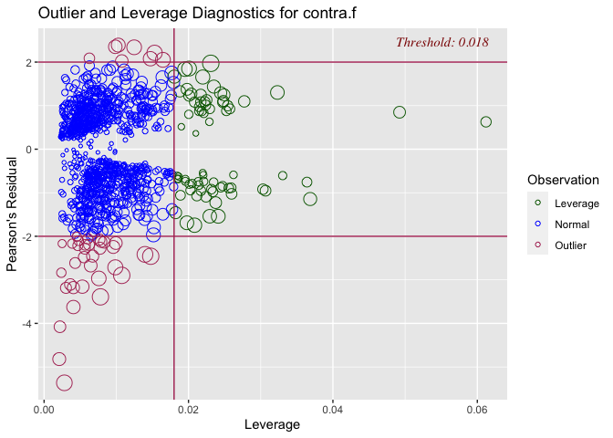<!-- -->

There are no observations with significant influence and leverage.

 

# **Interpretation and Conclusion**

A one unit increase in wife’s age is associated with 0.98 times the odds
of contraceptive use. A one unit increase in number of children is
associated with 1.61 times the odds of contraceptive use. A woman with
higher education is associated with 4.28 times the odds than a woman
with no education. A woman with a high standard of living index is
associated with 2.1 times the odds than a woman with poor standard of
living.

Overall, a woman’s age, education, religion, current number of children,
standard of living, and media exposure can predict contraceptive use.
From the diagnostics ran, the model can use improvement in terms of
model fit but there is no influential data points.
